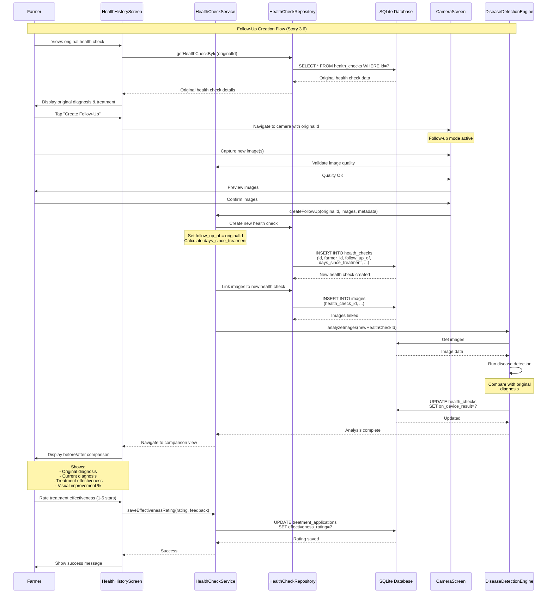
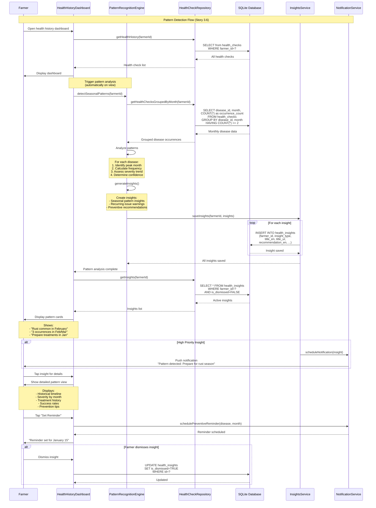
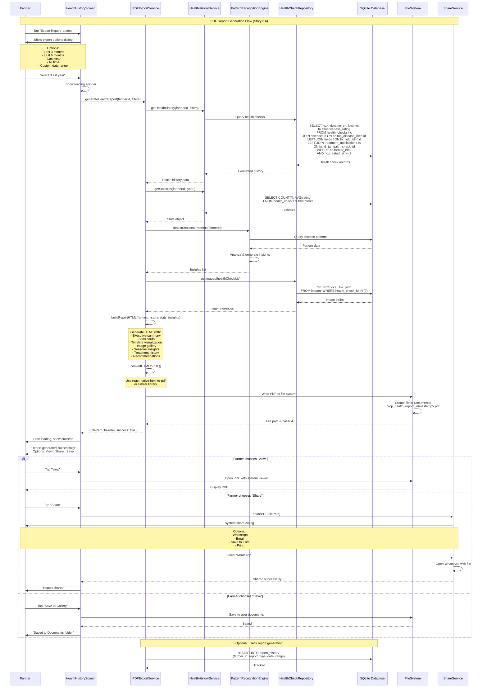

# Zarai Dost - Comprehensive Architecture Document

**Version**: 2.0  
**Last Updated**: October 24, 2025  
**Status**: Active Development (Epic 3 - 44.4% Complete)

---

## Table of Contents

1. [Executive Summary](#executive-summary)
2. [System Architecture Overview](#system-architecture-overview)
3. [Component Architecture](#component-architecture)
4. [Data Architecture](#data-architecture)
5. [Integration Architecture](#integration-architecture)
6. [Key Flow Sequence Diagrams](#key-flow-sequence-diagrams)
7. [Technology Stack](#technology-stack)
8. [Security Architecture](#security-architecture)
9. [Performance & Scalability](#performance--scalability)
10. [Deployment Architecture](#deployment-architecture)

---

## Executive Summary

Zarai Dost is an **offline-first, AI-powered agricultural advisory mobile application** designed specifically for Pakistani farmers. The system architecture prioritizes:

- **Offline-First Operation**: Full functionality without internet connectivity
- **Multimodal AI**: On-device TensorFlow Lite + Cloud vision (Gemini/GPT-4V)
- **SQLite-Centric**: 19 tables, version 9, supporting complete offline workflows
- **Smart Sync**: Intelligent background synchronization with conflict resolution
- **Multilingual**: English, Urdu, Punjabi, Sindhi support throughout

### Current Implementation Status
- **Database**: 9 migrations, 19 tables, version 9
- **Services**: 40+ services across AI, cache, cloud, image, monitoring, supplier, sync
- **Repositories**: 18 data access repositories
- **UI Components**: 20+ reusable components
- **Test Coverage**: 25+ test files

---

## System Architecture Overview

### High-Level Architecture

```
┌─────────────────────────────────────────────────────────────────────┐
│                        MOBILE APPLICATION                           │
│                    (React Native + Expo SDK 52)                     │
├─────────────────────────────────────────────────────────────────────┤
│                                                                     │
│  ┌──────────────┐  ┌──────────────┐  ┌──────────────┐            │
│  │   UI Layer   │  │  Components  │  │   Screens    │            │
│  │              │  │  (20+ items) │  │  (14 items)  │            │
│  └──────┬───────┘  └──────┬───────┘  └──────┬───────┘            │
│         │                 │                  │                     │
│         └─────────────────┴──────────────────┘                     │
│                           │                                         │
│  ┌────────────────────────▼─────────────────────────┐             │
│  │           Service Layer (40+ Services)           │             │
│  │  ┌──────────┐ ┌────────┐ ┌────────┐ ┌─────────┐│             │
│  │  │ AI (8)   │ │Cache(5)│ │Cloud(5)│ │ Sync(5) ││             │
│  │  └──────────┘ └────────┘ └────────┘ └─────────┘│             │
│  │  ┌──────────┐ ┌────────┐ ┌────────┐ ┌─────────┐│             │
│  │  │Image (6) │ │Monitor │ │Supplier│ │ API (2) ││             │
│  │  └──────────┘ └────────┘ └────────┘ └─────────┘│             │
│  └────────────────────────┬─────────────────────────┘             │
│                           │                                         │
│  ┌────────────────────────▼─────────────────────────┐             │
│  │       Repository Layer (18 Repositories)         │             │
│  │    (Data Access Objects + Business Logic)        │             │
│  └────────────────────────┬─────────────────────────┘             │
│                           │                                         │
│  ┌────────────────────────▼─────────────────────────┐             │
│  │              SQLite Database (v9)                │             │
│  │              19 Tables, 9 Migrations             │             │
│  │         ~28,000 Lines of Production Code         │             │
│  └──────────────────────────────────────────────────┘             │
│                                                                     │
└─────────────────────────────────────────────────────────────────────┘
                              │
                              │ Sync When Online
                              │
┌─────────────────────────────▼─────────────────────────────────────┐
│                    CLOUD SERVICES (Planned)                        │
├─────────────────────────────────────────────────────────────────────┤
│  ┌──────────────┐  ┌──────────────┐  ┌──────────────┐            │
│  │  AI Vision   │  │  PostgreSQL  │  │   AWS S3     │            │
│  │  (Gemini,    │  │  (Backend    │  │  (Image      │            │
│  │   GPT-4V)    │  │   Database)  │  │   Storage)   │            │
│  └──────────────┘  └──────────────┘  └──────────────┘            │
│                                                                     │
│  ┌──────────────┐  ┌──────────────┐  ┌──────────────┐            │
│  │  GraphQL API │  │  Lambda Fns  │  │  API Gateway │            │
│  │  (Sync Ops)  │  │  (Business   │  │  (REST/      │            │
│  │              │  │   Logic)     │  │   GraphQL)   │            │
│  └──────────────┘  └──────────────┘  └──────────────┘            │
└─────────────────────────────────────────────────────────────────────┘
```

### Architectural Principles

1. **Offline-First**: All core features work without internet
2. **Progressive Enhancement**: Online features enhance but don't replace offline
3. **Data Sovereignty**: Farmers own their data, stored locally
4. **Sync Intelligence**: Smart conflict resolution, minimal data transfer
5. **Platform Compatibility**: iOS, Android native; Web for preview only
6. **Modular Design**: Services are independent, replaceable
7. **Fail-Safe**: Graceful degradation when services unavailable

---

## Component Architecture

### Layer Breakdown

#### 1. Presentation Layer

**UI Screens (14 total)**
- `FarmDashboard` - Main dashboard with field/crop overview
- `QueryHistory` - Historical AI queries
- `CropDetails` - Individual crop health details
- `SyncSettings` - Sync configuration
- `ModelSettings` - AI model management
- `WeatherForecast` - 7-day weather cache
- `AdvisoriesHome` - Agricultural advisories
- `SyncStatusDashboard` - Sync monitoring
- `DataUsageStats` - Data consumption analytics
- `CameraScreen` - Image capture interface
- `ImagePreviewScreen` - Multi-image preview
- `HealthCheckSubmission` - Health check submission
- `DiseaseResultScreen` - Disease detection results
- `SupplierDemoScreen` - Supplier search/contact

**Reusable Components (20+)**
- Sync components: `SyncButton`, `SyncStatusIndicator`
- Image components: `ImageThumbnail`, `UploadProgressBar`, `SyncStatusBadge`
- Cache components: `DataFreshnessIndicator`, `CachedDataBanner`, `LastUpdatedLabel`
- Status components: `NetworkStatusIndicator`, `PendingChangesCounter`, `LastSyncLabel`
- Health components: `CropTypeSelector`
- Supplier components: `SupplierCard`, `ContactButtons`, `AvailabilityBadge`, `FavoriteToggleButton`

#### 2. Service Layer (40+ Services)

**AI Services (8)**
```
services/ai/
├── DiseaseDetectionEngine.js      # TFLite inference (mock-ready)
├── DiseaseResultParser.js         # Result parsing & formatting
├── ImagePreprocessor.js           # Image preprocessing pipeline
├── InferenceCache.js              # Inference result caching
├── InferenceEngine.js             # Base inference engine
├── ModelDownloader.js             # Model download management
├── ModelManager.js                # Model lifecycle management
└── MultiImageAnalyzer.js          # Multi-image consensus analysis
```

**Cache Services (5)**
```
services/cache/
├── AdvisoryCacheService.js        # Advisory caching (irrigation/market/climate)
├── CacheRefreshOrchestrator.js    # Coordinated cache refresh
├── CacheSizeMonitor.js            # 10MB cache limit enforcement
├── StalenessDetector.js           # 5-level staleness detection
└── WeatherCacheService.js         # 7-day weather caching
```

**Cloud Services (5)**
```
services/cloud/
├── CloudAnalysisQueue.js          # Cloud analysis queue management
├── CloudVisionService.js          # Multi-provider orchestration
├── GeminiVisionProvider.js        # Google Gemini integration
├── GPT4VisionProvider.js          # OpenAI GPT-4V integration
└── ResultComparison.js            # On-device vs cloud comparison
```

**Image Services (6)**
```
services/image/
├── ImageCaptureService.js         # Camera integration
├── ImageStorageManager.js         # Storage monitoring & cleanup
├── ImageUploadQueue.js            # Offline upload queue
├── ImageValidator.js              # Quality validation
├── LocationService.js             # GPS capture & EXIF
└── S3UploadService.js            # AWS S3 upload (mock-ready)
```

**Sync Services (5)**
```
services/sync/
├── BackgroundSync.js              # Background fetch configuration
├── ConflictResolver.js            # Timestamp-based conflict resolution
├── NetworkMonitor.js              # Connectivity detection
├── SyncQueue.js                   # Priority-based sync queue
└── SyncService.js                 # Sync orchestration
```

**Monitoring Services (3)**
```
services/monitoring/
├── DataUsageTracker.js            # WiFi/cellular data tracking
├── NetworkQualityMonitor.js       # Connection quality assessment
└── SyncStateManager.js            # Sync state management
```

**Supplier Services (6)**
```
services/supplier/
├── AvailabilityTracker.js         # Product availability tracking
├── FavoritesManager.js            # Favorite suppliers management
├── SupplierContactService.js      # Phone/WhatsApp/SMS integration
├── SupplierDataSeeder.js          # Sample data population
├── SupplierSearchService.js       # Location-based search (Haversine)
└── TreatmentSupplierIntegration.js # Link treatments to suppliers
```

**API Services (2)**
```
services/api/
├── GraphQLClient.js               # GraphQL client (mock-ready)
└── SyncMutations.js               # GraphQL mutation definitions
```

#### 3. Repository Layer (18 Repositories)

All repositories extend `BaseRepository` with CRUD operations:

**Core Repositories**
- `FarmerRepository` - Farmer profiles with statistics
- `FieldRepository` - Field management with acreage
- `CropRepository` - Crop records with status
- `QueryRepository` - AI query history with search
- `ImageRepository` - Image metadata with queue operations

**AI & Model Repositories**
- `ModelMetadataRepository` - Model versioning
- `InferenceCacheRepository` - Cached inference results
- `DiseaseRepository` - Disease taxonomy (55 classes)

**Cache Repositories**
- `WeatherCacheRepository` - 7-day weather retention
- `AdvisoryCacheRepository` - Priority-based advisory retention

**Sync & Monitoring Repositories**
- `SyncHistoryRepository` - Last 100 sync operations
- `DataUsageRepository` - WiFi/cellular breakdown
- `SyncPreferencesRepository` - User sync settings
- `SyncStateMetadataRepository` - Sync system state

**Health Check Repositories**
- `HealthCheckRepository` - Health check sessions with images

**Supplier Repositories**
- `SupplierRepository` - Supplier directory with geospatial
- `FavoriteSupplierRepository` - Favorites management (max 20)

---

## Data Architecture

### Database Schema (SQLite v9)

#### Schema Overview (19 Tables)

```sql
-- CORE DATA (Story 1.1)
farmers               -- Farmer profiles
fields                -- Agricultural fields  
crops                 -- Crop records
queries               -- AI query history
images                -- Image metadata and cache

-- AI & MODELS (Stories 1.3, 3.2)
model_metadata        -- AI model versioning
inference_cache       -- Cached inference results
diseases              -- Disease taxonomy (55 classes)

-- CACHING (Story 1.5)
weather_cache         -- 7-day weather forecasts
advisories_cache      -- Agricultural advisories
cache_metadata        -- Cache management

-- SYNC & MONITORING (Stories 1.2, 1.6)
sync_history          -- Sync operation logs (last 100)
data_usage            -- Data consumption tracking
sync_preferences      -- User sync settings
sync_state_metadata   -- Sync system state

-- CROP HEALTH (Stories 3.1, 3.3)
health_checks         -- Health check sessions
cloud_analysis_queue  -- Cloud analysis queue

-- SUPPLIERS (Story 3.5)
suppliers             -- Supplier directory
supplier_products     -- Product catalog
farmer_favorite_suppliers      -- Favorites (max 20)
product_alternatives           -- Alternative products
farmer_contributions           -- Crowdsourced data
supplier_contact_attempts      -- Contact tracking
```

#### Key Table Relationships

```
farmers (1) ──→ (M) fields
fields (1) ──→ (M) crops
crops (1) ──→ (M) images
farmers (1) ──→ (M) health_checks
health_checks (1) ──→ (M) images (via health_check_id)
diseases (1) ──→ (M) health_checks (via top_disease_id)
suppliers (1) ──→ (M) supplier_products
farmers (M) ←──→ (M) suppliers (via farmer_favorite_suppliers)
```

#### Critical Indexes

```sql
-- Performance Indexes
CREATE INDEX idx_images_health_check ON images(health_check_id);
CREATE INDEX idx_health_checks_farmer ON health_checks(farmer_id);
CREATE INDEX idx_health_checks_created ON health_checks(created_at DESC);
CREATE INDEX idx_diseases_class_id ON diseases(class_id);
CREATE INDEX idx_sync_history_created ON sync_history(created_at DESC);
CREATE INDEX idx_data_usage_date ON data_usage(date DESC);

-- Geospatial (Haversine-compatible)
CREATE INDEX idx_suppliers_location ON suppliers(latitude, longitude);
```

### Data Flow Patterns

#### Write Path (Offline-First)
```
User Action → Service → Repository → SQLite (sync_status='pending')
                                          ↓
                            Background Sync detects 'pending'
                                          ↓
                            Network available → Upload to cloud
                                          ↓
                            Update sync_status='synced'
```

#### Read Path (Cache-First)
```
User Request → Service → Check Cache (inference_cache, weather_cache, etc.)
                              ↓ (miss)
                         Check SQLite
                              ↓ (miss)
                         Fetch from Cloud (if online)
                              ↓
                         Store in Cache & SQLite
                              ↓
                         Return to User
```

---

## Integration Architecture

### External Integrations

#### 1. AI Vision Providers (Story 3.3)

**Google Gemini Vision**
```javascript
// Provider: GeminiVisionProvider.js
Endpoint: Google AI Studio API
Model: gemini-1.5-flash
Input: Base64 image + structured prompt
Output: JSON with disease diagnosis + treatment reasoning
Fallback: GPT-4 Vision
```

**OpenAI GPT-4 Vision**
```javascript
// Provider: GPT4VisionProvider.js
Endpoint: OpenAI API
Model: gpt-4-vision-preview
Input: Image URL/Base64 + structured prompt
Output: JSON with detailed analysis
Fallback: On-device only
```

#### 2. Cloud Storage (Planned - Story 1.4)

**AWS S3**
```javascript
// Service: S3UploadService.js
Method: Pre-signed URLs for secure upload
Bucket: zarai-dost-images-{env}
Path: /{farmerId}/{healthCheckId}/{imageId}.jpg
Compression: 80% quality JPEG
Max Size: 10MB per image
```

#### 3. Backend API (Planned - Story 1.2)

**GraphQL Sync**
```javascript
// Client: GraphQLClient.js
Endpoint: https://api.zaraidost.com/graphql
Authentication: JWT tokens
Operations:
  - syncFarmerData(farmerId, data)
  - syncHealthChecks(checks)
  - getWeatherForecast(location)
  - getAdvisories(farmerId)
```

#### 4. Location Services (Story 3.1)

**expo-location**
```javascript
// Service: LocationService.js
Accuracy: Balanced (10-100m)
Timeout: 5 seconds
Caching: 60 seconds
Fallback: EXIF GPS data
```

#### 5. Camera Integration (Story 3.1)

**expo-camera + expo-image-picker**
```javascript
// Service: ImageCaptureService.js
Camera: Front/back toggle, flash control
Quality: 80% JPEG compression
Max Images: 5 per health check
Validation: Blur detection, resolution check (640x640 min)
```

---

## Key Flow Sequence Diagrams

### 1. Follow-Up Health Check Creation Flow

This sequence shows how a farmer creates a follow-up health check to track treatment progress.



### 2. Disease Pattern Detection Flow

This sequence shows how the system analyzes historical data to detect seasonal disease patterns.



### 3. PDF Health Report Generation Flow

This sequence shows how a comprehensive PDF report is generated from health history data.



---

## Technology Stack

### Mobile Application

**Framework & Runtime**
- React Native 0.76.9
- Expo SDK 52.0.17
- React 18.3.1
- JavaScript ES6+

**Database & Storage**
- expo-sqlite 15.1.4 (SQLite v3)
- expo-file-system 18.0.4
- AsyncStorage (via expo)

**Navigation & State**
- @react-navigation/native 6.1.18
- @react-navigation/native-stack 6.11.0
- React Hooks (useState, useEffect, useContext)

**Camera & Media**
- expo-camera (latest)
- expo-image-picker 16.0.6
- expo-image-manipulator 13.0.6

**Location & Network**
- expo-location 18.0.10
- @react-native-community/netinfo 11.4.1

**Background Tasks**
- expo-background-fetch 13.0.6
- expo-task-manager 12.0.6

**AI & ML**
- @tensorflow/tfjs (planned)
- @tensorflow/tfjs-react-native (planned)

**Utilities**
- uuid 11.0.4
- expo-crypto 14.0.2

**Web Support**
- react-native-web 0.19.13
- react-dom 18.3.1

**Testing**
- jest 29.7.0
- jest-expo 52.0.1
- @testing-library/react-native 12.4.0

### Cloud Services (Planned/Partial)

**AI Vision**
- Google Gemini Vision 1.5 Flash (implemented)
- OpenAI GPT-4 Vision (implemented)

**Backend (Planned)**
- Node.js 18+
- Express.js
- Apollo GraphQL Server
- PostgreSQL 14+
- AWS Lambda
- AWS API Gateway

**Storage (Planned)**
- AWS S3 (image storage)
- AWS DynamoDB (supplemental NoSQL)

**Monitoring (Planned)**
- AWS CloudWatch
- Sentry (error tracking)
- Mixpanel (analytics)

---

## Security Architecture

### Data Security

**Encryption at Rest**
```javascript
// Database encryption (planned)
- SQLite: SQLCipher for database encryption
- Files: expo-crypto for file encryption
- Keys: Secure storage via expo-secure-store
```

**Encryption in Transit**
```javascript
// All network communication
- HTTPS only (TLS 1.3)
- Certificate pinning for API calls
- JWT token authentication
- Token refresh mechanism
```

**Data Privacy**
```javascript
// User data ownership
- All data stored locally first
- Sync is opt-in
- User can delete all data
- GDPR/PDPA compliant
- No data sold to third parties
```

### Authentication & Authorization (Planned)

```javascript
// JWT-based authentication
Authentication Flow:
1. User registers/logs in
2. Backend issues JWT (expires 1 hour)
3. Refresh token (expires 30 days)
4. All API calls include Authorization header
5. Backend validates JWT on each request

Authorization Levels:
- Farmer: Own data only
- Extension Officer: Multiple farmers (with consent)
- Admin: System-wide access
```

### Secure API Communication

```javascript
// GraphQL with authentication
POST https://api.zaraidost.com/graphql
Headers: {
  Authorization: Bearer <JWT_TOKEN>
  Content-Type: application/json
  X-Client-Version: 1.5.0
  X-Device-ID: <UUID>
}
```

---

## Performance & Scalability

### Mobile Performance Targets

**App Launch**
- Cold start: < 3 seconds
- Warm start: < 1 second
- Database ready: < 500ms

**Image Processing**
- Capture to preview: < 500ms
- Quality validation: < 1 second
- On-device inference: < 5 seconds (AC3 - Story 3.2)
- Multi-image (3): < 15 seconds

**Database Operations**
- Simple query: < 50ms
- Complex join: < 200ms
- Sync operation: < 5 seconds (for 100 records)

**UI Responsiveness**
- Screen transition: < 300ms
- Button press feedback: < 100ms
- List scroll: 60fps
- Pull-to-refresh: < 1 second

### Offline Performance

**Storage Limits**
- Total app size: < 100MB (AC2 - Story 1.1)
- Model size: < 50MB (Story 1.3)
- Cache size: < 10MB (Story 1.5)
- Image queue: 50 images max (Story 1.4)

**Sync Performance**
- Pending items: Auto-sync < 1000 records
- Background fetch: Every 15 minutes
- Conflict resolution: < 100ms per record
- Batch size: 100 records per request

### Scalability Considerations

**Database Growth**
```
Estimated annual growth per farmer:
- Health checks: 50-100 (weekly usage)
- Images: 250-500 (5 per check)
- Disease records: 50-100
- Weather cache: Rolling 7-day (stable)
- Advisories: Rolling latest 5 (stable)

Mitigation:
- Auto-cleanup queries > 90 days (Story 1.1)
- Image queue limit 50 (Story 1.4)
- Cache size limit 10MB (Story 1.5)
- Archive & sync old data to cloud
```

**Backend Scalability (Planned)**
```
- Lambda functions: Auto-scale
- PostgreSQL: Read replicas
- S3: Infinite storage
- API Gateway: Rate limiting (1000 req/min per user)
- CloudFront: CDN for static assets
```

---

## Deployment Architecture

### Mobile App Deployment

**Build Process**
```bash
# Development builds
expo start --dev-client

# Production builds (EAS Build)
eas build --platform ios --profile production
eas build --platform android --profile production

# OTA Updates (Expo Updates)
eas update --branch production --message "Bug fixes"
```

**Distribution**
- iOS: Apple App Store (TestFlight for beta)
- Android: Google Play Store (Internal testing track)
- Web: Netlify/Vercel (preview only)

**Version Management**
```
Versioning: Semantic (MAJOR.MINOR.PATCH)
Current: 1.5.0
- MAJOR: Breaking changes
- MINOR: New features
- PATCH: Bug fixes

Database versions managed separately (currently v9)
```

### Backend Deployment (Planned)

**Infrastructure as Code**
```yaml
# Terraform/CloudFormation
Resources:
  - Lambda Functions (Node.js 18)
  - API Gateway (REST + GraphQL)
  - PostgreSQL RDS (Multi-AZ)
  - S3 Buckets (with lifecycle policies)
  - CloudFront Distribution
  - Route53 (DNS)
  - ACM (SSL certificates)
```

**Environments**
```
Development:
  - API: https://dev-api.zaraidost.com
  - Database: dev-db instance
  - S3: zarai-dost-images-dev

Staging:
  - API: https://staging-api.zaraidost.com
  - Database: staging-db instance
  - S3: zarai-dost-images-staging

Production:
  - API: https://api.zaraidost.com
  - Database: production-db (Multi-AZ)
  - S3: zarai-dost-images-prod
  - CloudFront: CDN enabled
```

---

## Appendix: Architecture Decision Records (ADRs)

### ADR-001: Offline-First Architecture
**Status**: Accepted  
**Context**: Pakistani farmers have intermittent internet connectivity  
**Decision**: Build all core features to work offline first, sync when online  
**Consequences**: Increased complexity in sync logic, but dramatically better UX

### ADR-002: SQLite for Local Storage
**Status**: Accepted  
**Context**: Need reliable, fast local database  
**Decision**: Use SQLite via expo-sqlite  
**Consequences**: Excellent performance, but limited to relational data

### ADR-003: React Native with Expo
**Status**: Accepted  
**Context**: Need cross-platform mobile app with rapid development  
**Decision**: Use React Native with Expo managed workflow  
**Consequences**: Faster development, some limitations on native modules

### ADR-004: Multi-Provider AI Vision
**Status**: Accepted  
**Context**: Reliability concerns with single AI provider  
**Decision**: Implement multi-provider strategy (Gemini + GPT-4V)  
**Consequences**: Increased cost, better reliability and fallback

### ADR-005: Repository Pattern for Data Access
**Status**: Accepted  
**Context**: Need clean separation of data access logic  
**Decision**: Implement repository pattern with base repository  
**Consequences**: More boilerplate, but excellent maintainability

### ADR-006: Haversine Distance in SQLite
**Status**: Accepted  
**Context**: Need location-based supplier search without PostGIS  
**Decision**: Implement Haversine formula in SQLite queries  
**Consequences**: Works well for small datasets, may need optimization

---

## Document History

| Version | Date | Changes | Author |
|---------|------|---------|--------|
| 1.0 | 2025-10-22 | Initial architecture document | System Architect |
| 2.0 | 2025-10-24 | Comprehensive update with sequence diagrams | Claude Sonnet 4.5 |

---

## Related Documents

- [System Overview](./system-overview.md)
- [Component Definitions](./component-definitions.md)
- [Data Flow Diagram](./data-flow-diagram.md)
- [Architectural Principles](./architectural-principles-and-best-practices.md)
- [Non-Functional Specifications](./non-functional-specifications.md)
- [ADRs](./architecture-decision-records-adrs.md)
- [Story 3.6 Architecture](./story-3.6-disease-history-architecture.md)

---

**Document Status**: ✅ Active  
**Maintained By**: Development Team  
**Review Frequency**: After major feature completion  
**Last Review**: October 24, 2025

