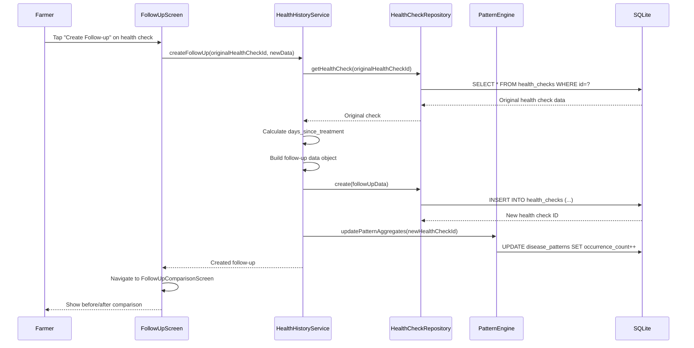
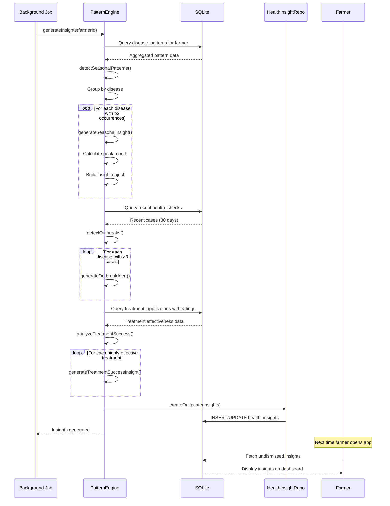
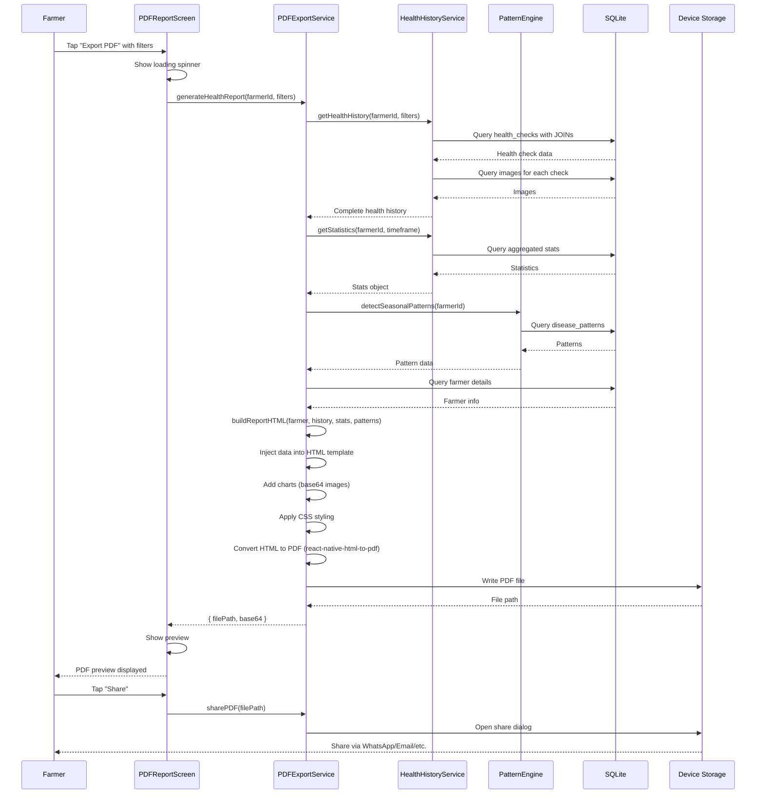
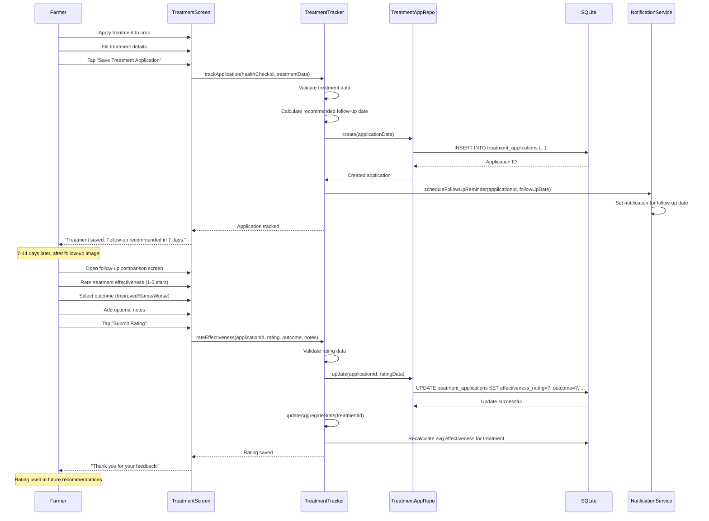
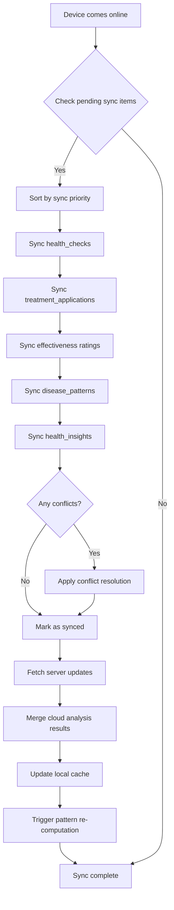

# Architecture Document: Story 3.6 - Disease History and Tracking

**Document Version:** 1.0
**Created:** 2025-10-23
**Author:** Winston (Architect)
**Status:** Approved for Implementation

---

## Table of Contents

1. [Executive Summary](#1-executive-summary)
2. [Requirements Analysis](#2-requirements-analysis)
3. [Data Architecture](#3-data-architecture)
4. [Service Layer Architecture](#4-service-layer-architecture)
5. [UI/UX Component Architecture](#5-uiux-component-architecture)
6. [Sequence Diagrams](#6-sequence-diagrams)
7. [Offline-First Synchronization](#7-offline-first-synchronization)
8. [Cross-Cutting Concerns](#8-cross-cutting-concerns)
9. [Integration Points](#9-integration-points)
10. [Implementation Roadmap](#10-implementation-roadmap)
11. [Risk Analysis & Mitigation](#11-risk-analysis--mitigation)
12. [Success Metrics](#12-success-metrics)

---

## 1. Executive Summary

### 1.1 Purpose

Story 3.6 implements a comprehensive disease history and tracking system that transforms ZaraiDost from a diagnostic tool into a longitudinal crop health management platform. This feature enables farmers to:

- **Track** all crop health diagnoses with complete metadata
- **Monitor** treatment applications and their effectiveness over time
- **Compare** before/after images through follow-up checks
- **Visualize** crop health timelines by field and crop type
- **Discover** seasonal disease patterns and receive preventive insights
- **Export** comprehensive health reports as shareable PDFs

### 1.2 Architectural Approach

This architecture follows a **layered, offline-first** design pattern:

```
┌─────────────────────────────────────────────────┐
│         Presentation Layer (React Native)        │
│  Timeline UI | Dashboard | Insights | Reports   │
└─────────────────────┬───────────────────────────┘
                      │
┌─────────────────────┴───────────────────────────┐
│              Service Layer (Business Logic)      │
│  History | Patterns | Tracking | PDF Export     │
└─────────────────────┬───────────────────────────┘
                      │
┌─────────────────────┴───────────────────────────┐
│         Data Access Layer (Repositories)         │
│  HealthCheck | Treatment | Pattern | Insight    │
└─────────────────────┬───────────────────────────┘
                      │
┌─────────────────────┴───────────────────────────┐
│           Persistence Layer (SQLite)             │
│  Offline-first with sync to PostgreSQL backend  │
└──────────────────────────────────────────────────┘
```

### 1.3 Key Architectural Principles

1. **Offline-First**: All tracking operations work without connectivity
2. **Event Sourcing**: Complete lifecycle tracking from detection → treatment → resolution
3. **Aggregated Analytics**: Pre-computed patterns for fast insights
4. **Progressive Enhancement**: Basic tracking works immediately; insights improve with data
5. **Privacy by Design**: GDPR-compliant with user-controlled data retention
6. **Performance-Optimized**: Indexed queries, pagination, caching strategies

---

## 2. Requirements Analysis

### 2.1 Functional Requirements Mapping

| AC | Requirement | Priority | Complexity | Architectural Components |
|----|------------|----------|-----------|-------------------------|
| AC1 | Save all diagnoses with timestamps and images | P0 | Low | `health_checks` extension, image linking |
| AC2 | Track treatment applications | P0 | Medium | `treatment_applications` table, TreatmentTracker service |
| AC3 | Follow-up image comparison | P0 | High | Recursive `follow_up_of` relationship, comparison UI |
| AC4 | Timeline view by field/crop | P0 | Medium | Timeline queries, visualization components |
| AC5 | Treatment effectiveness ratings | P0 | Low | Rating fields, aggregation logic |
| AC6 | Export history as PDF | P1 | High | PDFExportService, HTML templates |
| AC7 | Seasonal pattern detection | P1 | High | PatternRecognitionEngine, `disease_patterns` table |

**Priority Legend:** P0 = Critical, P1 = Important, P2 = Nice-to-have

### 2.2 Non-Functional Requirements

#### Performance Requirements

| Operation | Target | Measurement |
|-----------|--------|-------------|
| Timeline query (50 items) | < 500ms | 95th percentile |
| Follow-up chain retrieval | < 300ms | Average |
| Statistics calculation | < 200ms | Average |
| PDF generation (50 checks) | < 3s | 90th percentile |
| Pattern detection (1 year data) | < 2s | Average |

#### Storage Requirements

| Data Type | Growth Rate | Retention | Archival Strategy |
|-----------|-------------|-----------|-------------------|
| Health checks | ~10/farmer/month | 5 years | Archive after 2 years |
| Images | ~30/farmer/month | 2 years | Compress after 6 months |
| Treatment records | ~8/farmer/month | 5 years | Keep all |
| Patterns | ~12/farmer/year | Indefinite | Aggregate monthly |
| Insights | ~5/farmer/month | 1 year | Delete dismissed after 30 days |

#### Scalability Requirements

- Support 100,000+ farmers
- Handle 5+ years of historical data per farmer
- Timeline queries scale with pagination
- Pattern detection scales with pre-aggregation

---

## 3. Data Architecture

### 3.1 Database Schema Design

#### 3.1.1 Migration 010: Disease History Tracking

```sql
-- ============================================================================
-- Migration 010: Disease History and Tracking
-- Story 3.6: Disease History and Tracking
-- ============================================================================

-- Extend health_checks table for lifecycle tracking
-- Supports: AC1 (timestamps), AC2 (treatment link), AC3 (follow-up chain)
ALTER TABLE health_checks ADD COLUMN resolution_status TEXT DEFAULT 'ongoing';
  -- Values: 'ongoing', 'resolved', 'recurred'
ALTER TABLE health_checks ADD COLUMN resolved_at TIMESTAMP;
ALTER TABLE health_checks ADD COLUMN follow_up_of TEXT;
  -- References: health_checks.id (recursive relationship)
ALTER TABLE health_checks ADD COLUMN days_since_treatment INTEGER;
ALTER TABLE health_checks ADD COLUMN top_disease_id TEXT;
  -- References: diseases.id
ALTER TABLE health_checks ADD COLUMN severity TEXT;
  -- Values: 'mild', 'moderate', 'severe'

-- Indexes for efficient querying
CREATE INDEX IF NOT EXISTS idx_health_checks_resolution
  ON health_checks(resolution_status);
CREATE INDEX IF NOT EXISTS idx_health_checks_follow_up
  ON health_checks(follow_up_of);
CREATE INDEX IF NOT EXISTS idx_health_checks_disease
  ON health_checks(top_disease_id);

-- ============================================================================
-- Treatment Applications Table (AC2, AC5)
-- Tracks which treatments farmers applied and their effectiveness
-- ============================================================================
CREATE TABLE IF NOT EXISTS treatment_applications (
  id TEXT PRIMARY KEY,
  health_check_id TEXT NOT NULL,
  treatment_id TEXT NOT NULL,
  product_id TEXT,
  application_date DATE NOT NULL,
  application_method TEXT,
    -- spray, foliar, soil_drench, seed_treatment
  dosage_used TEXT,
  field_size_acres REAL,
  cost_pkr INTEGER,

  -- AC5: Effectiveness tracking
  effectiveness_rating INTEGER,
    -- 1-5 stars (farmer feedback)
  outcome TEXT,
    -- 'improved', 'no_change', 'worsened'
  feedback_notes TEXT,
  rating_timestamp TIMESTAMP,
  follow_up_date DATE,

  created_at TIMESTAMP DEFAULT CURRENT_TIMESTAMP,
  updated_at TIMESTAMP DEFAULT CURRENT_TIMESTAMP,
  sync_status TEXT DEFAULT 'pending',

  FOREIGN KEY (health_check_id) REFERENCES health_checks(id) ON DELETE CASCADE,
  FOREIGN KEY (treatment_id) REFERENCES treatments(id),
  FOREIGN KEY (product_id) REFERENCES treatment_products(id)
);

CREATE INDEX IF NOT EXISTS idx_treatment_applications_health_check
  ON treatment_applications(health_check_id);
CREATE INDEX IF NOT EXISTS idx_treatment_applications_date
  ON treatment_applications(application_date DESC);
CREATE INDEX IF NOT EXISTS idx_treatment_applications_rating
  ON treatment_applications(effectiveness_rating);

-- ============================================================================
-- Disease Patterns Table (AC7)
-- Pre-aggregated seasonal pattern data for fast queries
-- ============================================================================
CREATE TABLE IF NOT EXISTS disease_patterns (
  id TEXT PRIMARY KEY,
  farmer_id TEXT NOT NULL,
  disease_id TEXT NOT NULL,
  field_id TEXT,
  crop_type TEXT,

  -- Temporal dimensions
  month INTEGER,  -- 1-12
  season TEXT,    -- 'spring', 'summer', 'monsoon', 'winter'
  year INTEGER,

  -- Aggregated metrics
  occurrence_count INTEGER DEFAULT 1,
  severity_avg REAL,
  location_region TEXT,

  created_at TIMESTAMP DEFAULT CURRENT_TIMESTAMP,
  updated_at TIMESTAMP DEFAULT CURRENT_TIMESTAMP,

  FOREIGN KEY (farmer_id) REFERENCES farmers(id) ON DELETE CASCADE,
  FOREIGN KEY (disease_id) REFERENCES diseases(id),
  FOREIGN KEY (field_id) REFERENCES fields(id) ON DELETE SET NULL
);

CREATE INDEX IF NOT EXISTS idx_disease_patterns_farmer
  ON disease_patterns(farmer_id);
CREATE INDEX IF NOT EXISTS idx_disease_patterns_disease_month
  ON disease_patterns(disease_id, month);
CREATE INDEX IF NOT EXISTS idx_disease_patterns_field_year
  ON disease_patterns(field_id, year);
CREATE INDEX IF NOT EXISTS idx_disease_patterns_season
  ON disease_patterns(season, crop_type);

-- ============================================================================
-- Health Insights Table (AC7)
-- Stores computed insights for offline access and dismissal tracking
-- ============================================================================
CREATE TABLE IF NOT EXISTS health_insights (
  id TEXT PRIMARY KEY,
  farmer_id TEXT NOT NULL,
  insight_type TEXT,
    -- 'seasonal_pattern', 'treatment_success', 'recurring_issue',
    -- 'outbreak_alert', 'preventive_recommendation'

  -- Multilingual content
  title_en TEXT,
  title_ur TEXT,
  description_en TEXT,
  description_ur TEXT,
  recommendation_en TEXT,
  recommendation_ur TEXT,

  -- Metadata
  related_disease_id TEXT,
  confidence_score REAL,  -- 0.0 to 1.0
  is_dismissed BOOLEAN DEFAULT 0,

  created_at TIMESTAMP DEFAULT CURRENT_TIMESTAMP,
  updated_at TIMESTAMP DEFAULT CURRENT_TIMESTAMP,

  FOREIGN KEY (farmer_id) REFERENCES farmers(id) ON DELETE CASCADE,
  FOREIGN KEY (related_disease_id) REFERENCES diseases(id)
);

CREATE INDEX IF NOT EXISTS idx_health_insights_farmer
  ON health_insights(farmer_id);
CREATE INDEX IF NOT EXISTS idx_health_insights_type
  ON health_insights(insight_type);
CREATE INDEX IF NOT EXISTS idx_health_insights_dismissed
  ON health_insights(is_dismissed);
CREATE INDEX IF NOT EXISTS idx_health_insights_created
  ON health_insights(created_at DESC);
```

### 3.2 Entity Relationship Diagram

```
┌──────────────┐
│   Farmer     │
│   (1.1)      │
└──────┬───────┘
       │ 1
       │
       │ M
┌──────┴────────────┐      ┌──────────────────┐
│  Health_Checks    │──────│  Images          │
│  (3.1, 3.6)       │ 1  M │  (3.1)           │
└───────┬───┬───────┘      └──────────────────┘
        │   │
        │   │ M            ┌──────────────────┐
        │   └──────────────│ Treatment_Apps   │
        │              1   │ (3.6)            │
        │                  └────────┬─────────┘
        │                           │ M
        │ 1                         │
        │                           │ 1
        │ (follow_up_of)    ┌───────┴─────────┐      ┌──────────────┐
        └───────────────────│  Treatments     │──────│  Products    │
                       Self │  (3.4)          │ 1  M │  (3.4)       │
                       Ref  └─────────────────┘      └──────────────┘

┌──────────────┐      ┌──────────────────┐
│   Farmer     │──────│ Disease_Patterns │
│   (1.1)      │ 1  M │ (3.6)            │
└──────────────┘      └──────┬───────────┘
                             │ M
                             │
                             │ 1
                      ┌──────┴───────────┐
                      │   Diseases       │
                      │   (3.2)          │
                      └──────────────────┘

┌──────────────┐      ┌──────────────────┐      ┌──────────────┐
│   Farmer     │──────│ Health_Insights  │──────│  Diseases    │
│   (1.1)      │ 1  M │ (3.6)            │ M  1 │  (3.2)       │
└──────────────┘      └──────────────────┘      └──────────────┘
```

### 3.3 Data Model Design Decisions

#### Resolution Status Lifecycle

```
Health Check Lifecycle:
┌──────────┐
│ Created  │
│ (pending)│
└────┬─────┘
     │
     ▼
┌──────────────┐     ┌─────────────┐
│  Analyzing   │────▶│  Analyzed   │
│ (on-device/  │     │ (results    │
│  cloud)      │     │  available) │
└──────────────┘     └──────┬──────┘
                            │
                            ▼
                     ┌──────────────┐
                     │ Treatment    │
                     │ Applied      │
                     └──────┬───────┘
                            │
                     ┌──────┴──────┐
                     │             │
                     ▼             ▼
              ┌───────────┐ ┌─────────────┐
              │ Resolved  │ │  Ongoing    │
              │           │ │ (needs more │
              │           │ │  follow-up) │
              └───────────┘ └──────┬──────┘
                     ▲             │
                     │             ▼
                     │      ┌─────────────┐
                     └──────│  Recurred   │
                            │             │
                            └─────────────┘
```

#### Follow-up Chain Structure

```sql
-- Example follow-up chain:
Original Health Check (ID: HC001)
  ├── Follow-up 1 (ID: HC002, follow_up_of: HC001, days_since_treatment: 7)
  ├── Follow-up 2 (ID: HC003, follow_up_of: HC001, days_since_treatment: 14)
  └── Follow-up 3 (ID: HC004, follow_up_of: HC001, days_since_treatment: 30)

-- Recursive query to retrieve chain:
WITH RECURSIVE follow_up_chain AS (
  SELECT *, 0 as depth FROM health_checks WHERE id = 'HC001'
  UNION ALL
  SELECT hc.*, fc.depth + 1
  FROM health_checks hc
  JOIN follow_up_chain fc ON hc.follow_up_of = fc.id
)
SELECT * FROM follow_up_chain ORDER BY depth, created_at;
```

#### Pattern Aggregation Strategy

```javascript
// Pattern Detection Algorithm
// Runs nightly or on-demand after new health check

async function updatePatternAggregates(healthCheckId) {
  const healthCheck = await getHealthCheck(healthCheckId);

  // Extract temporal dimensions
  const date = new Date(healthCheck.created_at);
  const month = date.getMonth() + 1;
  const year = date.getFullYear();
  const season = getSeason(month); // Maps month to season

  // Find or create pattern record
  const pattern = await findOrCreatePattern({
    farmer_id: healthCheck.farmer_id,
    disease_id: healthCheck.top_disease_id,
    field_id: healthCheck.field_id,
    crop_type: healthCheck.crop_type,
    month,
    season,
    year
  });

  // Update aggregates
  pattern.occurrence_count += 1;
  pattern.severity_avg = (
    (pattern.severity_avg * (pattern.occurrence_count - 1)) +
    getSeverityScore(healthCheck.severity)
  ) / pattern.occurrence_count;

  await savePattern(pattern);
}

function getSeason(month) {
  if (month >= 3 && month <= 5) return 'spring';
  if (month >= 6 && month <= 8) return 'summer';
  if (month >= 9 && month <= 11) return 'monsoon';
  return 'winter';
}

function getSeverityScore(severity) {
  return { mild: 1, moderate: 2, severe: 3 }[severity] || 2;
}
```

---

## 4. Service Layer Architecture

### 4.1 Service Component Diagram

```
┌─────────────────────────────────────────────────────────────────┐
│                    Presentation Layer                            │
│  TimelineScreen | DashboardScreen | FollowUpScreen | PDFScreen  │
└────────────────────────┬────────────────────────────────────────┘
                         │
┌────────────────────────┴────────────────────────────────────────┐
│                      Service Layer                               │
│                                                                  │
│  ┌────────────────────────┐  ┌────────────────────────┐        │
│  │  HealthHistoryService  │  │ PatternRecognition     │        │
│  │                        │  │ Engine                 │        │
│  │ • getHealthHistory()   │  │ • detectPatterns()     │        │
│  │ • getFollowUpChain()   │  │ • generateInsights()   │        │
│  │ • getStatistics()      │  │ • analyzeOutbreaks()   │        │
│  │ • createFollowUp()     │  │ • predictRiskPeriods() │        │
│  │ • getTimelineData()    │  │ • updateAggregates()   │        │
│  └───────────┬────────────┘  └───────────┬────────────┘        │
│              │                            │                      │
│  ┌───────────┴────────────┐  ┌───────────┴────────────┐        │
│  │  TreatmentTracker      │  │  PDFExportService      │        │
│  │                        │  │                        │        │
│  │ • trackApplication()   │  │ • generateReport()     │        │
│  │ • rateEffectiveness()  │  │ • buildReportHTML()    │        │
│  │ • getStats()           │  │ • shareReport()        │        │
│  │ • suggestFollowUp()    │  │ • exportData()         │        │
│  └────────────────────────┘  └────────────────────────┘        │
│                                                                  │
└──────────────────────────────────────────────────────────────────┘
                         │
┌────────────────────────┴────────────────────────────────────────┐
│                   Data Access Layer                              │
│  HealthCheckRepository | TreatmentAppRepository |               │
│  DiseasePatternRepository | HealthInsightRepository             │
└──────────────────────────────────────────────────────────────────┘
```

### 4.2 Service Interfaces

#### 4.2.1 HealthHistoryService

```javascript
/**
 * HealthHistoryService
 * Manages historical health check data and timeline queries
 */
class HealthHistoryService {
  /**
   * Get complete health history with optional filters
   * @param {string} farmerId - Farmer ID
   * @param {Object} filters - Optional filters
   * @param {string} filters.fieldId - Filter by field
   * @param {string} filters.cropType - Filter by crop type
   * @param {Date} filters.startDate - Start date range
   * @param {Date} filters.endDate - End date range
   * @param {string} filters.diseaseId - Filter by disease
   * @param {string} filters.status - Filter by resolution status
   * @param {number} filters.limit - Pagination limit (default: 20)
   * @param {number} filters.offset - Pagination offset
   * @returns {Promise<Array<HealthCheck>>}
   */
  async getHealthHistory(farmerId, filters = {}) {
    const {
      fieldId,
      cropType,
      startDate,
      endDate,
      diseaseId,
      status,
      limit = 20,
      offset = 0
    } = filters;

    // Build dynamic query
    let query = `
      SELECT
        hc.*,
        d.name_en as disease_name,
        d.name_ur as disease_name_ur,
        d.category as disease_category,
        d.severity as disease_severity,
        f.name as field_name,
        c.crop_type,
        COUNT(DISTINCT i.id) as image_count,
        COUNT(DISTINCT ta.id) as treatment_count,
        AVG(ta.effectiveness_rating) as avg_effectiveness
      FROM health_checks hc
      LEFT JOIN diseases d ON hc.top_disease_id = d.id
      LEFT JOIN fields f ON hc.field_id = f.id
      LEFT JOIN crops c ON hc.crop_id = c.id
      LEFT JOIN images i ON hc.id = i.health_check_id
      LEFT JOIN treatment_applications ta ON hc.id = ta.health_check_id
      WHERE hc.farmer_id = ?
    `;

    const params = [farmerId];

    if (fieldId) {
      query += ` AND hc.field_id = ?`;
      params.push(fieldId);
    }

    if (cropType) {
      query += ` AND hc.crop_type = ?`;
      params.push(cropType);
    }

    if (startDate) {
      query += ` AND hc.created_at >= ?`;
      params.push(startDate.toISOString());
    }

    if (endDate) {
      query += ` AND hc.created_at <= ?`;
      params.push(endDate.toISOString());
    }

    if (diseaseId) {
      query += ` AND hc.top_disease_id = ?`;
      params.push(diseaseId);
    }

    if (status) {
      query += ` AND hc.resolution_status = ?`;
      params.push(status);
    }

    query += `
      GROUP BY hc.id
      ORDER BY hc.created_at DESC
      LIMIT ? OFFSET ?
    `;
    params.push(limit, offset);

    const results = await db.query(query, params);

    // Enrich with images and treatments
    for (const result of results) {
      result.images = await this.getHealthCheckImages(result.id);
      result.treatments = await this.getHealthCheckTreatments(result.id);
    }

    return results;
  }

  /**
   * Get follow-up chain for a health check
   * Returns original check + all follow-ups in chronological order
   * @param {string} originalHealthCheckId - Original health check ID
   * @returns {Promise<Array<HealthCheck>>}
   */
  async getFollowUpChain(originalHealthCheckId) {
    const query = `
      WITH RECURSIVE follow_up_chain AS (
        -- Base case: original health check
        SELECT
          hc.*,
          0 as depth,
          0 as days_since_original
        FROM health_checks hc
        WHERE id = ?

        UNION ALL

        -- Recursive case: follow-ups
        SELECT
          hc.*,
          fc.depth + 1 as depth,
          CAST((JULIANDAY(hc.created_at) - JULIANDAY(fc.created_at)) AS INTEGER) as days_since_original
        FROM health_checks hc
        JOIN follow_up_chain fc ON hc.follow_up_of = fc.id
      )
      SELECT * FROM follow_up_chain
      ORDER BY depth ASC, created_at ASC
    `;

    const chain = await db.query(query, [originalHealthCheckId]);

    // Enrich each with images
    for (const check of chain) {
      check.images = await this.getHealthCheckImages(check.id);
      check.treatments = await this.getHealthCheckTreatments(check.id);
    }

    return chain;
  }

  /**
   * Get aggregate statistics for dashboard
   * @param {string} farmerId - Farmer ID
   * @param {string} timeframe - 'week', 'month', 'season', 'year'
   * @returns {Promise<Object>} Statistics object
   */
  async getStatistics(farmerId, timeframe = 'year') {
    const startDate = this.getStartDate(timeframe);

    const stats = await db.query(`
      SELECT
        COUNT(DISTINCT hc.id) as total_issues,
        COUNT(DISTINCT CASE WHEN hc.resolution_status = 'resolved' THEN hc.id END) as resolved_issues,
        COUNT(DISTINCT CASE WHEN hc.resolution_status = 'ongoing' THEN hc.id END) as ongoing_issues,
        COUNT(DISTINCT CASE WHEN hc.resolution_status = 'recurred' THEN hc.id END) as recurred_issues,
        COUNT(DISTINCT hc.top_disease_id) as unique_diseases,
        AVG(ta.effectiveness_rating) as avg_treatment_effectiveness,
        COUNT(DISTINCT hc.field_id) as affected_fields,
        COUNT(DISTINCT ta.id) as total_treatments_applied
      FROM health_checks hc
      LEFT JOIN treatment_applications ta ON hc.id = ta.health_check_id
      WHERE hc.farmer_id = ? AND hc.created_at >= ?
    `, [farmerId, startDate]);

    // Get most common disease
    const mostCommon = await db.query(`
      SELECT
        d.id,
        d.name_en,
        d.name_ur,
        COUNT(*) as occurrence_count
      FROM health_checks hc
      JOIN diseases d ON hc.top_disease_id = d.id
      WHERE hc.farmer_id = ? AND hc.created_at >= ?
      GROUP BY d.id
      ORDER BY occurrence_count DESC
      LIMIT 1
    `, [farmerId, startDate]);

    return {
      ...stats[0],
      most_common_disease: mostCommon[0] || null,
      timeframe,
      start_date: startDate,
      resolution_rate: stats[0].total_issues > 0
        ? (stats[0].resolved_issues / stats[0].total_issues * 100).toFixed(1)
        : 0
    };
  }

  /**
   * Create a follow-up health check linked to original
   * @param {string} originalHealthCheckId - Original health check ID
   * @param {Object} newHealthCheckData - New health check data
   * @returns {Promise<HealthCheck>}
   */
  async createFollowUp(originalHealthCheckId, newHealthCheckData) {
    const original = await this.getHealthCheck(originalHealthCheckId);

    // Calculate days since treatment
    const latestTreatment = await this.getLatestTreatment(originalHealthCheckId);
    const daysSinceTreatment = latestTreatment
      ? Math.floor((Date.now() - new Date(latestTreatment.application_date)) / (1000 * 60 * 60 * 24))
      : null;

    const followUp = {
      ...newHealthCheckData,
      follow_up_of: originalHealthCheckId,
      days_since_treatment: daysSinceTreatment,
      farmer_id: original.farmer_id,
      field_id: original.field_id,
      crop_id: original.crop_id,
      crop_type: original.crop_type
    };

    const created = await HealthCheckRepository.create(followUp);

    // Trigger pattern update
    await PatternRecognitionEngine.updatePatternAggregates(created.id);

    return created;
  }

  /**
   * Get timeline data grouped by period
   * @param {string} farmerId - Farmer ID
   * @param {string} groupBy - 'day', 'week', 'month', 'year'
   * @param {Object} filters - Optional filters
   * @returns {Promise<Array<TimelineGroup>>}
   */
  async getTimelineData(farmerId, groupBy = 'month', filters = {}) {
    const history = await this.getHealthHistory(farmerId, { ...filters, limit: 1000 });

    // Group by specified period
    const grouped = this.groupByPeriod(history, groupBy);

    return grouped;
  }

  // Helper methods
  getStartDate(timeframe) {
    const now = new Date();
    switch (timeframe) {
      case 'week': return new Date(now.setDate(now.getDate() - 7));
      case 'month': return new Date(now.setMonth(now.getMonth() - 1));
      case 'season': return new Date(now.setMonth(now.getMonth() - 3));
      case 'year': return new Date(now.setFullYear(now.getFullYear() - 1));
      default: return new Date(now.setFullYear(now.getFullYear() - 1));
    }
  }

  groupByPeriod(items, groupBy) {
    const groups = {};

    items.forEach(item => {
      const date = new Date(item.created_at);
      let key;

      switch (groupBy) {
        case 'day':
          key = date.toISOString().split('T')[0];
          break;
        case 'week':
          const week = this.getWeekNumber(date);
          key = `${date.getFullYear()}-W${week}`;
          break;
        case 'month':
          key = `${date.getFullYear()}-${String(date.getMonth() + 1).padStart(2, '0')}`;
          break;
        case 'year':
          key = String(date.getFullYear());
          break;
      }

      if (!groups[key]) {
        groups[key] = {
          period: key,
          items: [],
          count: 0,
          resolved_count: 0
        };
      }

      groups[key].items.push(item);
      groups[key].count++;
      if (item.resolution_status === 'resolved') {
        groups[key].resolved_count++;
      }
    });

    return Object.values(groups).sort((a, b) => b.period.localeCompare(a.period));
  }

  getWeekNumber(date) {
    const oneJan = new Date(date.getFullYear(), 0, 1);
    const numberOfDays = Math.floor((date - oneJan) / (24 * 60 * 60 * 1000));
    return Math.ceil((date.getDay() + 1 + numberOfDays) / 7);
  }
}

export default new HealthHistoryService();
```

#### 4.2.2 PatternRecognitionEngine

```javascript
/**
 * PatternRecognitionEngine
 * Analyzes historical data to detect patterns and generate insights
 */
class PatternRecognitionEngine {
  /**
   * Detect seasonal patterns for a farmer
   * @param {string} farmerId - Farmer ID
   * @returns {Promise<Array<Pattern>>}
   */
  async detectSeasonalPatterns(farmerId) {
    // Query aggregated patterns from disease_patterns table
    const patterns = await db.query(`
      SELECT
        dp.*,
        d.name_en,
        d.name_ur,
        d.category,
        COUNT(*) as total_occurrences
      FROM disease_patterns dp
      JOIN diseases d ON dp.disease_id = d.id
      WHERE dp.farmer_id = ?
      GROUP BY dp.disease_id, dp.month
      HAVING COUNT(*) >= 2
      ORDER BY dp.month, total_occurrences DESC
    `, [farmerId]);

    return patterns;
  }

  /**
   * Generate actionable insights from patterns
   * @param {string} farmerId - Farmer ID
   * @returns {Promise<Array<Insight>>}
   */
  async generateInsights(farmerId) {
    const patterns = await this.detectSeasonalPatterns(farmerId);
    const insights = [];

    // Group patterns by disease
    const diseaseMap = this.groupPatternsByDisease(patterns);

    // Generate insights for each disease with significant patterns
    for (const [diseaseId, diseasePatterns] of Object.entries(diseaseMap)) {
      if (diseasePatterns.length >= 2) {
        const insight = await this.generateSeasonalInsight(
          farmerId,
          diseaseId,
          diseasePatterns
        );
        insights.push(insight);
      }
    }

    // Detect outbreaks
    const outbreaks = await this.detectRecentOutbreaks(farmerId);
    insights.push(...outbreaks);

    // Analyze treatment success patterns
    const treatmentInsights = await this.analyzeTreatmentSuccess(farmerId);
    insights.push(...treatmentInsights);

    // Save insights to database
    for (const insight of insights) {
      await HealthInsightRepository.createOrUpdate(insight);
    }

    return insights;
  }

  /**
   * Generate seasonal insight for a disease
   * @private
   */
  async generateSeasonalInsight(farmerId, diseaseId, patterns) {
    const disease = patterns[0];
    const monthNames = [
      'January', 'February', 'March', 'April', 'May', 'June',
      'July', 'August', 'September', 'October', 'November', 'December'
    ];
    const monthNamesUr = [
      'جنوری', 'فروری', 'مارچ', 'اپریل', 'مئی', 'جون',
      'جولائی', 'اگست', 'ستمبر', 'اکتوبر', 'نومبر', 'دسمبر'
    ];

    // Find peak month
    const peakPattern = patterns.reduce((max, p) =>
      p.occurrence_count > max.occurrence_count ? p : max
    );
    const peakMonth = monthNames[peakPattern.month - 1];
    const peakMonthUr = monthNamesUr[peakPattern.month - 1];

    // Calculate next occurrence
    const currentMonth = new Date().getMonth() + 1;
    const monthsUntilPeak = peakPattern.month > currentMonth
      ? peakPattern.month - currentMonth
      : (12 - currentMonth) + peakPattern.month;

    const insight = {
      id: `insight-seasonal-${diseaseId}-${Date.now()}`,
      farmer_id: farmerId,
      insight_type: 'seasonal_pattern',
      title_en: `${disease.name_en} Pattern Detected`,
      title_ur: `${disease.name_ur} کا نمونہ دریافت ہوا`,
      description_en: `${disease.name_en} commonly occurs in ${peakMonth}. You've had ${peakPattern.occurrence_count} cases during this month over the past years.`,
      description_ur: `${disease.name_ur} عام طور پر ${peakMonthUr} میں ہوتا ہے۔ آپ کو گزشتہ سالوں میں اس مہینے میں ${peakPattern.occurrence_count} کیسز ہوئے ہیں۔`,
      recommendation_en: monthsUntilPeak <= 2
        ? `${peakMonth} is approaching. Consider preventive treatments now.`
        : `Prepare preventive treatments before ${peakMonth}.`,
      recommendation_ur: monthsUntilPeak <= 2
        ? `${peakMonthUr} قریب آ رہا ہے۔ ابھی روک تھام کا علاج کریں۔`
        : `${peakMonthUr} سے پہلے روک تھام کی تیاری کریں۔`,
      related_disease_id: diseaseId,
      confidence_score: Math.min(patterns.length / 12, 1.0),
      is_dismissed: false,
      created_at: new Date().toISOString()
    };

    return insight;
  }

  /**
   * Detect recent outbreak patterns
   * @private
   */
  async detectRecentOutbreaks(farmerId, timeWindowDays = 30) {
    const startDate = new Date();
    startDate.setDate(startDate.getDate() - timeWindowDays);

    const recentCases = await db.query(`
      SELECT
        top_disease_id,
        COUNT(*) as case_count,
        d.name_en,
        d.name_ur
      FROM health_checks hc
      JOIN diseases d ON hc.top_disease_id = d.id
      WHERE hc.farmer_id = ?
        AND hc.created_at >= ?
      GROUP BY top_disease_id
      HAVING COUNT(*) >= 3
    `, [farmerId, startDate.toISOString()]);

    const insights = recentCases.map(outbreak => ({
      id: `insight-outbreak-${outbreak.top_disease_id}-${Date.now()}`,
      farmer_id: farmerId,
      insight_type: 'outbreak_alert',
      title_en: `${outbreak.name_en} Outbreak Alert`,
      title_ur: `${outbreak.name_ur} کی وبا کی انتباہ`,
      description_en: `${outbreak.case_count} cases of ${outbreak.name_en} detected in the last ${timeWindowDays} days.`,
      description_ur: `گزشتہ ${timeWindowDays} دنوں میں ${outbreak.name_ur} کے ${outbreak.case_count} کیسز دریافت ہوئے۔`,
      recommendation_en: `Urgent action required. Apply recommended treatments immediately and monitor closely.`,
      recommendation_ur: `فوری کارروائی درکار ہے۔ تجویز کردہ علاج فوری طور پر لگائیں اور قریب سے نگرانی کریں۔`,
      related_disease_id: outbreak.top_disease_id,
      confidence_score: 0.9,
      is_dismissed: false,
      created_at: new Date().toISOString()
    }));

    return insights;
  }

  /**
   * Analyze treatment success patterns
   * @private
   */
  async analyzeTreatmentSuccess(farmerId) {
    const treatmentStats = await db.query(`
      SELECT
        ta.treatment_id,
        t.name_en,
        t.name_ur,
        COUNT(*) as application_count,
        AVG(ta.effectiveness_rating) as avg_rating,
        SUM(CASE WHEN ta.outcome = 'improved' THEN 1 ELSE 0 END) as improved_count
      FROM treatment_applications ta
      JOIN treatments t ON ta.treatment_id = t.id
      JOIN health_checks hc ON ta.health_check_id = hc.id
      WHERE hc.farmer_id = ?
        AND ta.effectiveness_rating IS NOT NULL
      GROUP BY ta.treatment_id
      HAVING COUNT(*) >= 2
      ORDER BY avg_rating DESC
    `, [farmerId]);

    const insights = [];

    // Highlight highly effective treatments
    const highlyEffective = treatmentStats.filter(t => t.avg_rating >= 4.0);
    for (const treatment of highlyEffective) {
      insights.push({
        id: `insight-treatment-success-${treatment.treatment_id}-${Date.now()}`,
        farmer_id: farmerId,
        insight_type: 'treatment_success',
        title_en: `${treatment.name_en} Works Well`,
        title_ur: `${treatment.name_ur} اچھا کام کرتا ہے`,
        description_en: `You've rated ${treatment.name_en} ${treatment.avg_rating.toFixed(1)}★ on average (${treatment.application_count} applications). ${treatment.improved_count} showed improvement.`,
        description_ur: `آپ نے ${treatment.name_ur} کو اوسطاً ${treatment.avg_rating.toFixed(1)}★ درجہ دیا ہے۔`,
        recommendation_en: `Consider using ${treatment.name_en} as your first choice for similar issues.`,
        recommendation_ur: `اسی طرح کے مسائل کے لیے ${treatment.name_ur} کو پہلی پسند کے طور پر استعمال کریں۔`,
        related_disease_id: null,
        confidence_score: Math.min(treatment.application_count / 10, 1.0),
        is_dismissed: false,
        created_at: new Date().toISOString()
      });
    }

    return insights;
  }

  /**
   * Update pattern aggregates after new health check
   * @param {string} healthCheckId - Health check ID
   */
  async updatePatternAggregates(healthCheckId) {
    const healthCheck = await HealthCheckRepository.findById(healthCheckId);

    if (!healthCheck || !healthCheck.top_disease_id) {
      return; // No disease detected, skip
    }

    const date = new Date(healthCheck.created_at);
    const month = date.getMonth() + 1;
    const year = date.getFullYear();
    const season = this.getSeason(month);

    // Find or create pattern record
    const existingPattern = await db.query(`
      SELECT * FROM disease_patterns
      WHERE farmer_id = ?
        AND disease_id = ?
        AND month = ?
        AND year = ?
        AND (field_id IS NULL OR field_id = ?)
    `, [
      healthCheck.farmer_id,
      healthCheck.top_disease_id,
      month,
      year,
      healthCheck.field_id || null
    ]);

    const severityScore = this.getSeverityScore(healthCheck.severity);

    if (existingPattern.length > 0) {
      // Update existing pattern
      const pattern = existingPattern[0];
      const newCount = pattern.occurrence_count + 1;
      const newAvgSeverity = (
        (pattern.severity_avg * pattern.occurrence_count) + severityScore
      ) / newCount;

      await db.query(`
        UPDATE disease_patterns
        SET occurrence_count = ?,
            severity_avg = ?,
            updated_at = CURRENT_TIMESTAMP
        WHERE id = ?
      `, [newCount, newAvgSeverity, pattern.id]);
    } else {
      // Create new pattern
      await db.query(`
        INSERT INTO disease_patterns (
          id, farmer_id, disease_id, field_id, crop_type,
          month, season, year, occurrence_count, severity_avg
        ) VALUES (?, ?, ?, ?, ?, ?, ?, ?, ?, ?)
      `, [
        `pattern-${Date.now()}-${Math.random().toString(36).substr(2, 9)}`,
        healthCheck.farmer_id,
        healthCheck.top_disease_id,
        healthCheck.field_id,
        healthCheck.crop_type,
        month,
        season,
        year,
        1,
        severityScore
      ]);
    }
  }

  // Helper methods
  groupPatternsByDisease(patterns) {
    const map = {};
    patterns.forEach(p => {
      if (!map[p.disease_id]) {
        map[p.disease_id] = [];
      }
      map[p.disease_id].push(p);
    });
    return map;
  }

  getSeason(month) {
    if (month >= 3 && month <= 5) return 'spring';
    if (month >= 6 && month <= 8) return 'summer';
    if (month >= 9 && month <= 11) return 'monsoon';
    return 'winter';
  }

  getSeverityScore(severity) {
    return { mild: 1, moderate: 2, severe: 3 }[severity] || 2;
  }
}

export default new PatternRecognitionEngine();
```

---

## 5. UI/UX Component Architecture

### 5.1 Screen Hierarchy

```
Health Navigation Tab
│
├─── HealthHistoryDashboard (Main Entry Point)
│    │
│    ├─ Summary Statistics Section
│    │  ├─ TotalIssuesCard
│    │  ├─ ResolvedIssuesCard
│    │  ├─ MostCommonDiseaseCard
│    │  └─ AvgTreatmentRatingCard
│    │
│    ├─ Insights Carousel
│    │  └─ InsightCard (dismissible)
│    │
│    ├─ Recent Activity List
│    │  └─ HealthCheckListItem
│    │
│    └─ Action Buttons
│       ├─ View Timeline Button → TimelineScreen
│       ├─ View Insights Button → InsightsScreen
│       └─ Export PDF Button → PDFReportScreen
│
├─── TimelineScreen
│    │
│    ├─ Filter & Controls Bar
│    │  ├─ FieldFilter Dropdown
│    │  ├─ CropTypeFilter Dropdown
│    │  ├─ DateRangePicker
│    │  └─ ZoomLevelSelector (Day/Week/Month/Year)
│    │
│    ├─ Timeline Visualization
│    │  └─ TimelineItem (repeating)
│    │     ├─ DateMarker
│    │     ├─ DiseaseIcon
│    │     ├─ SeverityIndicator
│    │     ├─ TreatmentBadge (if applied)
│    │     └─ StatusIndicator (ongoing/resolved/recurred)
│    │
│    └─ Detail Modal (on tap)
│       ├─ Health Check Details
│       ├─ Images Carousel
│       ├─ Treatments Applied
│       └─ Follow-up Button → FollowUpComparisonScreen
│
├─── FollowUpComparisonScreen
│    │
│    ├─ Before/After Section
│    │  ├─ Original Health Check Card
│    │  ├─ BeforeAfterImageSlider
│    │  └─ Improvement Metrics
│    │     ├─ Days Since Treatment
│    │     ├─ Visual Comparison Score
│    │     └─ Farmer Assessment
│    │
│    ├─ Follow-up Timeline
│    │  └─ FollowUpItem (repeating)
│    │     ├─ Date
│    │     ├─ Days Since Treatment
│    │     ├─ Status
│    │     └─ Images Thumbnail
│    │
│    ├─ Treatment Effectiveness Section
│    │  ├─ Treatment Name & Details
│    │  ├─ EffectivenessRatingInput (1-5 stars)
│    │  ├─ OutcomeSelector (Improved/Same/Worse)
│    │  └─ FeedbackNotesInput
│    │
│    └─ Actions
│       ├─ Add Another Follow-up Button
│       ├─ Mark as Resolved Button
│       └─ Share Comparison Button
│
├─── InsightsScreen
│    │
│    ├─ Seasonal Patterns Section
│    │  └─ SeasonalPatternCard (repeating)
│    │     ├─ Disease Name
│    │     ├─ Peak Months Chart
│    │     ├─ Occurrence Count
│    │     └─ Preventive Recommendation
│    │
│    ├─ Treatment Success Section
│    │  └─ TreatmentSuccessCard (repeating)
│    │     ├─ Treatment Name
│    │     ├─ Average Rating (stars)
│    │     ├─ Success Rate (%)
│    │     └─ Recommendation
│    │
│    ├─ Outbreak Alerts Section
│    │  └─ OutbreakAlertCard (repeating)
│    │     ├─ Alert Icon
│    │     ├─ Disease Name
│    │     ├─ Recent Cases Count
│    │     └─ Urgent Actions
│    │
│    └─ Dismissed Insights (expandable)
│
└─── PDFReportScreen
     │
     ├─ Report Configuration Section
     │  ├─ Date Range Selector
     │  ├─ Field/Crop Filters
     │  ├─ Include Options Checkboxes
     │  │  ├─ Include Images
     │  │  ├─ Include Insights
     │  │  ├─ Include Treatment History
     │  │  └─ Include Charts
     │  └─ Language Selector (English/Urdu)
     │
     ├─ Report Preview
     │  └─ PDF Preview Container
     │     (Scrollable preview of generated PDF)
     │
     └─ Actions
        ├─ Generate PDF Button
        ├─ Share Options
        │  ├─ WhatsApp
        │  ├─ Email
        │  └─ Save to Files
        └─ Print Button (if available)
```

### 5.2 Component Specifications

#### StatisticsCard Component
```javascript
/**
 * StatisticsCard
 * Displays a single statistic with icon, number, and label
 */
<StatisticsCard
  icon="checkmark-circle" // or 'alert-circle', 'leaf', 'star'
  value={42}
  label="Resolved Issues"
  trend="+12% vs last month" // optional
  color="success" // success, warning, danger, info
  onPress={() => {/* Navigate to detail */}}
/>
```

#### TimelineItem Component
```javascript
/**
 * TimelineItem
 * Represents a single event on the timeline
 */
<TimelineItem
  date="2025-10-15"
  diseaseName="Wheat Leaf Rust"
  diseaseNameUr="گندم کا زنگ"
  severity="moderate" // mild, moderate, severe
  status="resolved" // ongoing, resolved, recurred
  cropType="wheat"
  fieldName="North Field"
  imageCount={3}
  treatmentCount={1}
  onPress={() => {/* Show detail modal */}}
/>
```

#### BeforeAfterImageSlider Component
```javascript
/**
 * BeforeAfterImageSlider
 * Interactive before/after image comparison
 */
<BeforeAfterImageSlider
  beforeImage={{
    uri: 'file://path/to/original.jpg',
    date: '2025-10-01',
    label: 'Original (Oct 1)'
  }}
  afterImage={{
    uri: 'file://path/to/followup.jpg',
    date: '2025-10-15',
    label: 'After 14 days'
  }}
  comparisonMode="slider" // slider, split, fade
  showImprovement={true}
  improvementScore={0.75} // 0.0 to 1.0
/>
```

#### EffectivenessRating Component
```javascript
/**
 * EffectivenessRating
 * Collect farmer feedback on treatment effectiveness
 */
<EffectivenessRating
  treatmentName="Propiconazole Fungicide"
  currentRating={0} // 0 if not rated
  onRatingChange={(rating) => {/* 1-5 */}}
  onOutcomeChange={(outcome) => {/* improved, same, worse */}}
  onNotesChange={(notes) => {/* feedback text */}}
  showDetailedFeedback={true}
/>
```

#### SeasonalPatternChart Component
```javascript
/**
 * SeasonalPatternChart
 * Visualize disease occurrence by month
 */
<SeasonalPatternChart
  diseaseName="Wheat Leaf Rust"
  data={[
    { month: 1, count: 0 },
    { month: 2, count: 3 },
    { month: 3, count: 5 },
    // ... all 12 months
  ]}
  chartType="bar" // bar, heatmap, line
  highlightPeakMonth={true}
  showLabels={true}
/>
```

---

## 6. Sequence Diagrams

### 6.1 Follow-up Creation Workflow



### 6.2 Pattern Detection Workflow



### 6.3 PDF Generation Workflow



### 6.4 Treatment Tracking and Rating Workflow



---

## 7. Offline-First Synchronization

### 7.1 Local-First Operations

All disease history tracking operations function **100% offline**:

| Operation | Offline Support | Data Storage |
|-----------|----------------|--------------|
| View health history | ✅ Full | SQLite cache |
| Create follow-up | ✅ Full | Local SQLite first |
| Track treatment application | ✅ Full | Local with sync_status='pending' |
| Rate effectiveness | ✅ Full | Local first |
| View timeline | ✅ Full | Local data |
| Detect patterns | ✅ Full | Local aggregates |
| View insights | ✅ Full | Cached insights |
| Generate PDF | ✅ Full | Uses local data |

### 7.2 Synchronization Strategy

#### Sync Priority Order

```javascript
const SYNC_PRIORITIES = {
  HEALTH_CHECKS: 1,           // Highest priority
  TREATMENT_APPLICATIONS: 2,
  EFFECTIVENESS_RATINGS: 3,
  DISEASE_PATTERNS: 4,
  HEALTH_INSIGHTS: 5          // Lowest priority (re-computable)
};
```

#### Sync Flow



#### Conflict Resolution Rules

| Entity | Conflict Strategy | Rationale |
|--------|------------------|-----------|
| `health_checks` | Server wins | Cloud analysis may enrich data |
| `treatment_applications` | Last-write-wins (timestamp) | Farmer's device is source of truth |
| `effectiveness_ratings` | Last-write-wins | Latest rating reflects current opinion |
| `disease_patterns` | Merge and recompute | Aggregates can be recalculated |
| `health_insights` | Server wins | Server may have newer algorithm |

#### Sync Triggers

1. **Background Sync** (WiFi only)
   - Interval: Every 6 hours
   - Condition: WiFi connected + battery > 20%

2. **Manual Sync**
   - User-initiated pull-to-refresh
   - No network restrictions

3. **Event-Triggered Sync**
   - After creating new health check (if online)
   - Before PDF export (fetch latest cloud data)
   - After rating treatment (if online)

### 7.3 Sync Implementation

```javascript
/**
 * SyncService for Story 3.6 entities
 */
class HistorySyncService {
  async syncAll(farmerId) {
    const results = {
      healthChecks: 0,
      treatments: 0,
      ratings: 0,
      patterns: 0,
      insights: 0
    };

    try {
      // Priority 1: Health Checks
      results.healthChecks = await this.syncHealthChecks(farmerId);

      // Priority 2: Treatment Applications
      results.treatments = await this.syncTreatmentApplications(farmerId);

      // Priority 3: Effectiveness Ratings
      results.ratings = await this.syncEffectivenessRatings(farmerId);

      // Priority 4: Disease Patterns
      results.patterns = await this.syncDiseasePatterns(farmerId);

      // Priority 5: Health Insights
      results.insights = await this.syncHealthInsights(farmerId);

      // Fetch server updates
      await this.fetchServerUpdates(farmerId);

      return results;
    } catch (error) {
      console.error('[HistorySync] Sync failed:', error);
      throw error;
    }
  }

  async syncHealthChecks(farmerId) {
    const pending = await db.query(`
      SELECT * FROM health_checks
      WHERE farmer_id = ? AND sync_status = 'pending'
    `, [farmerId]);

    let synced = 0;
    for (const check of pending) {
      try {
        const response = await GraphQLClient.mutate({
          mutation: SYNC_HEALTH_CHECK,
          variables: { input: check }
        });

        // Update with server data (may include cloud analysis)
        await db.query(`
          UPDATE health_checks
          SET cloud_result = ?,
              sync_status = 'synced',
              updated_at = CURRENT_TIMESTAMP
          WHERE id = ?
        `, [response.data.syncHealthCheck.cloudResult, check.id]);

        synced++;
      } catch (error) {
        console.error(`[HistorySync] Failed to sync health check ${check.id}:`, error);
        // Mark as failed
        await db.query(`
          UPDATE health_checks
          SET sync_status = 'failed'
          WHERE id = ?
        `, [check.id]);
      }
    }

    return synced;
  }

  async syncTreatmentApplications(farmerId) {
    const pending = await db.query(`
      SELECT ta.* FROM treatment_applications ta
      JOIN health_checks hc ON ta.health_check_id = hc.id
      WHERE hc.farmer_id = ? AND ta.sync_status = 'pending'
    `, [farmerId]);

    let synced = 0;
    for (const application of pending) {
      try {
        await GraphQLClient.mutate({
          mutation: SYNC_TREATMENT_APPLICATION,
          variables: { input: application }
        });

        await db.query(`
          UPDATE treatment_applications
          SET sync_status = 'synced',
              updated_at = CURRENT_TIMESTAMP
          WHERE id = ?
        `, [application.id]);

        synced++;
      } catch (error) {
        console.error(`[HistorySync] Failed to sync treatment ${application.id}:`, error);
        await db.query(`
          UPDATE treatment_applications
          SET sync_status = 'failed'
          WHERE id = ?
        `, [application.id]);
      }
    }

    return synced;
  }

  async fetchServerUpdates(farmerId) {
    // Fetch any server-side updates (e.g., cloud analysis completed)
    const lastSync = await this.getLastSyncTimestamp(farmerId);

    const updates = await GraphQLClient.query({
      query: GET_HEALTH_CHECK_UPDATES,
      variables: {
        farmerId,
        since: lastSync
      }
    });

    // Merge updates into local database
    for (const update of updates.data.healthCheckUpdates) {
      await db.query(`
        UPDATE health_checks
        SET cloud_result = ?,
            updated_at = ?
        WHERE id = ?
      `, [update.cloudResult, update.updatedAt, update.id]);
    }

    await this.updateLastSyncTimestamp(farmerId);
  }
}
```

---

## 8. Cross-Cutting Concerns

### 8.1 Performance Optimization

#### Database Query Optimization

**Indexing Strategy:**
```sql
-- Most frequently used indexes
CREATE INDEX idx_health_checks_farmer ON health_checks(farmer_id);
CREATE INDEX idx_health_checks_created ON health_checks(created_at DESC);
CREATE INDEX idx_health_checks_disease ON health_checks(top_disease_id);
CREATE INDEX idx_health_checks_follow_up ON health_checks(follow_up_of);

-- Composite indexes for common queries
CREATE INDEX idx_health_checks_farmer_created
  ON health_checks(farmer_id, created_at DESC);
CREATE INDEX idx_health_checks_farmer_crop
  ON health_checks(farmer_id, crop_type, created_at DESC);
CREATE INDEX idx_disease_patterns_farmer_disease
  ON disease_patterns(farmer_id, disease_id, month);
```

**Query Performance Targets:**

| Query Type | Target | Strategy |
|------------|--------|----------|
| Timeline (20 items) | <300ms | Index on farmer_id + created_at DESC, pagination |
| Follow-up chain | <200ms | Index on follow_up_of, recursive CTE optimized |
| Statistics | <150ms | Aggregation with indexed columns |
| Pattern detection | <1s | Pre-aggregated disease_patterns table |
| PDF generation | <3s | Parallel queries, image thumbnails |

#### Caching Strategy

```javascript
/**
 * Multi-level cache for performance
 */
class HistoryCacheManager {
  constructor() {
    this.memoryCache = new Map(); // In-memory LRU cache
    this.cacheTimeout = {
      statistics: 3600000,      // 1 hour
      insights: 86400000,       // 24 hours
      patterns: 86400000,       // 24 hours
      timeline: 1800000         // 30 minutes
    };
  }

  async getStatistics(farmerId, timeframe) {
    const cacheKey = `stats:${farmerId}:${timeframe}`;

    // Check memory cache first
    if (this.memoryCache.has(cacheKey)) {
      const cached = this.memoryCache.get(cacheKey);
      if (Date.now() - cached.timestamp < this.cacheTimeout.statistics) {
        return cached.data;
      }
    }

    // Cache miss - compute and cache
    const stats = await HealthHistoryService.getStatistics(farmerId, timeframe);
    this.memoryCache.set(cacheKey, {
      data: stats,
      timestamp: Date.now()
    });

    return stats;
  }

  invalidateCache(farmerId) {
    // Clear all caches for farmer when new data added
    for (const [key, value] of this.memoryCache.entries()) {
      if (key.includes(farmerId)) {
        this.memoryCache.delete(key);
      }
    }
  }
}
```

#### Image Optimization

```javascript
/**
 * Image loading strategy for timeline and PDF
 */
const IMAGE_OPTIMIZATION = {
  timeline: {
    quality: 0.6,
    maxWidth: 200,
    maxHeight: 200
  },
  detail: {
    quality: 0.8,
    maxWidth: 800,
    maxHeight: 800
  },
  pdf: {
    quality: 0.7,
    maxWidth: 600,
    maxHeight: 600
  }
};

// Lazy loading for timeline
<FlatList
  data={healthChecks}
  renderItem={({item}) => <TimelineItem {...item} />}
  initialNumToRender={10}
  maxToRenderPerBatch={5}
  windowSize={5}
  removeClippedSubviews={true}
  getItemLayout={(data, index) => ({
    length: ITEM_HEIGHT,
    offset: ITEM_HEIGHT * index,
    index
  })}
/>
```

### 8.2 Security & Privacy

#### Data Protection

**Encryption at Rest:**
```javascript
// Sensitive fields encrypted in SQLite
const ENCRYPTED_FIELDS = [
  'health_checks.location_latitude',
  'health_checks.location_longitude',
  'health_checks.description',
  'treatment_applications.feedback_notes'
];

// Encryption using react-native-encrypted-storage
import EncryptedStorage from 'react-native-encrypted-storage';

async function encryptField(value) {
  const encrypted = await EncryptedStorage.setItem(
    `temp_${Date.now()}`,
    JSON.stringify(value)
  );
  return encrypted;
}
```

**Data Retention Policy:**
```javascript
const DATA_RETENTION_POLICY = {
  health_checks: '5 years',
  images: '2 years',
  treatment_applications: '5 years',
  disease_patterns: 'indefinite',
  health_insights: '1 year (dismissed after 30 days)'
};

// Automatic cleanup job
async function cleanupOldData(farmerId) {
  const fiveYearsAgo = new Date();
  fiveYearsAgo.setFullYear(fiveYearsAgo.getFullYear() - 5);

  // Archive old health checks
  await db.query(`
    UPDATE health_checks
    SET archived = 1
    WHERE farmer_id = ? AND created_at < ?
  `, [farmerId, fiveYearsAgo.toISOString()]);

  // Delete old images
  const twoYearsAgo = new Date();
  twoYearsAgo.setFullYear(twoYearsAgo.getFullYear() - 2);

  const oldImages = await db.query(`
    SELECT local_file_path FROM images
    WHERE created_at < ?
  `, [twoYearsAgo.toISOString()]);

  for (const img of oldImages) {
    await FileSystem.deleteAsync(img.local_file_path, { idempotent: true });
  }

  await db.query(`
    DELETE FROM images WHERE created_at < ?
  `, [twoYearsAgo.toISOString()]);
}
```

#### GDPR Compliance

```javascript
/**
 * GDPR Right to Delete
 */
async function deleteAllFarmerData(farmerId) {
  await db.execAsync('BEGIN TRANSACTION');

  try {
    // Delete health insights
    await db.query(`DELETE FROM health_insights WHERE farmer_id = ?`, [farmerId]);

    // Delete disease patterns
    await db.query(`DELETE FROM disease_patterns WHERE farmer_id = ?`, [farmerId]);

    // Delete treatment applications (cascade from health_checks)
    await db.query(`
      DELETE FROM treatment_applications
      WHERE health_check_id IN (
        SELECT id FROM health_checks WHERE farmer_id = ?
      )
    `, [farmerId]);

    // Delete images and files
    const images = await db.query(`
      SELECT i.local_file_path
      FROM images i
      JOIN health_checks hc ON i.health_check_id = hc.id
      WHERE hc.farmer_id = ?
    `, [farmerId]);

    for (const img of images) {
      await FileSystem.deleteAsync(img.local_file_path, { idempotent: true });
    }

    await db.query(`
      DELETE FROM images
      WHERE health_check_id IN (
        SELECT id FROM health_checks WHERE farmer_id = ?
      )
    `, [farmerId]);

    // Delete health checks
    await db.query(`DELETE FROM health_checks WHERE farmer_id = ?`, [farmerId]);

    await db.execAsync('COMMIT');

    return { success: true, message: 'All data deleted' };
  } catch (error) {
    await db.execAsync('ROLLBACK');
    throw error;
  }
}

/**
 * GDPR Right to Export
 */
async function exportAllFarmerData(farmerId) {
  // PDF export satisfies this requirement
  return await PDFExportService.generateHealthReport(farmerId, {
    startDate: null, // All time
    endDate: null,
    includeImages: true,
    includeInsights: true,
    includeTreatments: true
  });
}
```

### 8.3 Scalability

#### Data Growth Management

**Archival Strategy:**
```javascript
/**
 * Archive old health checks to reduce active dataset size
 */
async function archiveOldHealthChecks(farmerId, archiveThresholdYears = 2) {
  const archiveDate = new Date();
  archiveDate.setFullYear(archiveDate.getFullYear() - archiveThresholdYears);

  // Move to archived table (separate from main table)
  await db.query(`
    INSERT INTO health_checks_archive
    SELECT * FROM health_checks
    WHERE farmer_id = ?
      AND created_at < ?
      AND archived = 0
  `, [farmerId, archiveDate.toISOString()]);

  // Mark as archived in main table
  await db.query(`
    UPDATE health_checks
    SET archived = 1
    WHERE farmer_id = ? AND created_at < ?
  `, [farmerId, archiveDate.toISOString()]);

  // Compress images older than 6 months
  await compressOldImages(farmerId, 6);
}

async function compressOldImages(farmerId, monthsThreshold) {
  const compressDate = new Date();
  compressDate.setMonth(compressDate.getMonth() - monthsThreshold);

  const oldImages = await db.query(`
    SELECT i.* FROM images i
    JOIN health_checks hc ON i.health_check_id = hc.id
    WHERE hc.farmer_id = ?
      AND i.created_at < ?
      AND i.compressed = 0
  `, [farmerId, compressDate.toISOString()]);

  for (const image of oldImages) {
    try {
      // Compress to 50% quality
      const compressed = await ImageManipulator.manipulateAsync(
        image.local_file_path,
        [],
        { compress: 0.5 }
      );

      // Update path and mark as compressed
      await db.query(`
        UPDATE images
        SET local_file_path = ?,
            compressed = 1,
            file_size_bytes = ?
        WHERE id = ?
      `, [compressed.uri, compressed.size, image.id]);
    } catch (error) {
      console.error(`Failed to compress image ${image.id}:`, error);
    }
  }
}
```

#### Query Scalability

**Pagination Strategy:**
```javascript
/**
 * Cursor-based pagination for large datasets
 */
async function getTimelinePage(farmerId, cursor = null, pageSize = 20) {
  let query = `
    SELECT * FROM health_checks
    WHERE farmer_id = ?
  `;
  const params = [farmerId];

  if (cursor) {
    query += ` AND created_at < ?`;
    params.push(cursor);
  }

  query += ` ORDER BY created_at DESC LIMIT ?`;
  params.push(pageSize + 1); // Fetch one extra to determine if more pages exist

  const results = await db.query(query, params);

  const hasMore = results.length > pageSize;
  const items = results.slice(0, pageSize);
  const nextCursor = hasMore ? items[items.length - 1].created_at : null;

  return {
    items,
    hasMore,
    nextCursor
  };
}
```

**Background Processing:**
```javascript
/**
 * Offload pattern detection to background task
 */
import BackgroundFetch from 'react-native-background-fetch';

BackgroundFetch.configure({
  minimumFetchInterval: 720, // 12 hours
  stopOnTerminate: false,
  startOnBoot: true
}, async (taskId) => {
  console.log('[BackgroundFetch] Pattern detection started');

  try {
    // Get all farmers with new health checks
    const farmers = await db.query(`
      SELECT DISTINCT farmer_id
      FROM health_checks
      WHERE pattern_processed = 0
    `);

    for (const farmer of farmers) {
      await PatternRecognitionEngine.generateInsights(farmer.farmer_id);
    }

    // Mark as processed
    await db.query(`
      UPDATE health_checks
      SET pattern_processed = 1
      WHERE pattern_processed = 0
    `);

    BackgroundFetch.finish(taskId);
  } catch (error) {
    console.error('[BackgroundFetch] Pattern detection failed:', error);
    BackgroundFetch.finish(taskId);
  }
});
```

---

## 9. Integration Points

### 9.1 Integration with Epic 3 Stories

| Story | Integration Point | Data Flow | Dependencies |
|-------|------------------|-----------|--------------|
| **3.1: Image Capture** | Health checks with images | 3.1 creates health_check → 3.6 tracks history | health_checks table, images table |
| **3.2: On-Device Detection** | Disease ID storage | 3.2 sets top_disease_id → 3.6 uses for patterns | top_disease_id field, diseases table |
| **3.3: Cloud Analysis** | Enhanced results | 3.3 enriches cloud_result → 3.6 displays in timeline | cloud_result field |
| **3.4: Treatment Recommendations** | Treatment tracking | 3.4 recommends → 3.6 tracks application & rating | treatment_applications table |
| **3.5: Supplier Integration** | Product tracking | 3.5 provides products → 3.6 tracks which product used | product_id in treatment_applications |

### 9.2 End-to-End Flow Diagram

```mermaid
graph LR
    A[Farmer takes photo] -->|Story 3.1| B[Health Check Created]
    B -->|Story 3.2| C[On-device Detection]
    C -->|Story 3.3| D[Cloud Analysis]
    D -->|Story 3.4| E[Treatment Recommended]
    E -->|Story 3.6| F[Treatment Applied & Tracked]
    F --> G[Follow-up Reminder]
    G -->|Story 3.1| H[Follow-up Image]
    H -->|Story 3.6| I[Before/After Comparison]
    I -->|Story 3.6| J[Effectiveness Rating]
    J -->|Story 3.6| K[Pattern Detection]
    K -->|Story 3.6| L[Seasonal Insights]
    L -->|Story 3.6| M[PDF Report]

    style F fill:#4CAF50
    style I fill:#4CAF50
    style J fill:#4CAF50
    style K fill:#4CAF50
    style L fill:#4CAF50
    style M fill:#4CAF50
```



### 9.3 GraphQL API Integration

**Schema Additions:**
```graphql
type Query {
  # Story 3.6 additions
  getHealthHistory(
    farmerId: ID!
    filters: HealthHistoryFilters
  ): HealthHistoryResponse!

  getFollowUpChain(originalHealthCheckId: ID!): [HealthCheck!]!

  getHealthStatistics(
    farmerId: ID!
    timeframe: String
  ): HealthStatistics!

  getSeasonalPatterns(farmerId: ID!): [DiseasePattern!]!

  getHealthInsights(
    farmerId: ID!
    dismissed: Boolean
  ): [HealthInsight!]!
}

type Mutation {
  # Story 3.6 additions
  createFollowUpHealthCheck(
    originalHealthCheckId: ID!
    input: HealthCheckInput!
  ): HealthCheck!

  trackTreatmentApplication(
    input: TreatmentApplicationInput!
  ): TreatmentApplication!

  rateTreatmentEffectiveness(
    applicationId: ID!
    rating: Int!
    outcome: TreatmentOutcome!
    notes: String
  ): TreatmentApplication!

  dismissInsight(insightId: ID!): HealthInsight!

  generatePDFReport(
    farmerId: ID!
    filters: HealthHistoryFilters
  ): PDFReport!

  syncHealthCheck(input: HealthCheckInput!): HealthCheck!
  syncTreatmentApplication(input: TreatmentApplicationInput!): TreatmentApplication!
}

input HealthHistoryFilters {
  fieldId: ID
  cropType: String
  startDate: DateTime
  endDate: DateTime
  diseaseId: ID
  status: ResolutionStatus
  limit: Int
  offset: Int
}

type HealthHistoryResponse {
  items: [HealthCheck!]!
  total: Int!
  hasMore: Boolean!
}

type HealthStatistics {
  totalIssues: Int!
  resolvedIssues: Int!
  ongoingIssues: Int!
  recurredIssues: Int!
  uniqueDiseases: Int!
  avgTreatmentEffectiveness: Float
  affectedFields: Int!
  totalTreatmentsApplied: Int!
  mostCommonDisease: Disease
  resolutionRate: Float!
  timeframe: String!
}

type DiseasePattern {
  id: ID!
  disease: Disease!
  month: Int!
  season: Season!
  occurrenceCount: Int!
  severityAvg: Float!
  year: Int!
}

type HealthInsight {
  id: ID!
  insightType: InsightType!
  titleEn: String!
  titleUr: String!
  descriptionEn: String!
  descriptionUr: String!
  recommendationEn: String!
  recommendationUr: String!
  relatedDisease: Disease
  confidenceScore: Float!
  isDismissed: Boolean!
  createdAt: DateTime!
}

enum InsightType {
  SEASONAL_PATTERN
  TREATMENT_SUCCESS
  RECURRING_ISSUE
  OUTBREAK_ALERT
  PREVENTIVE_RECOMMENDATION
}

enum TreatmentOutcome {
  IMPROVED
  NO_CHANGE
  WORSENED
}

enum Season {
  SPRING
  SUMMER
  MONSOON
  WINTER
}

enum ResolutionStatus {
  ONGOING
  RESOLVED
  RECURRED
}
```

---

## 10. Implementation Roadmap

### Phase 1: Database Extensions (Week 1, Days 1-2)

**Tasks:**
- [ ] Create migration 010 script
- [ ] Extend health_checks table (resolution_status, follow_up_of, etc.)
- [ ] Create treatment_applications table
- [ ] Create disease_patterns table
- [ ] Create health_insights table
- [ ] Update DatabaseConstants.js to version 10
- [ ] Integrate migration into db.config.js
- [ ] Test migration on clean database
- [ ] Test migration on existing database with data

**Deliverables:**
- `010_disease_history.js` migration file
- Updated DatabaseConstants.js
- Migration test suite

### Phase 2: Repository Layer (Week 1, Days 3-5)

**Tasks:**
- [ ] Extend HealthCheckRepository
  - [ ] Add getHealthHistory() with filters
  - [ ] Add getFollowUpChain()
  - [ ] Add getStatistics()
  - [ ] Add createFollowUp()
- [ ] Create TreatmentApplicationRepository
  - [ ] CRUD operations
  - [ ] Rating updates
  - [ ] Aggregate effectiveness queries
- [ ] Create DiseasePatternRepository
  - [ ] findOrCreate pattern records
  - [ ] Update aggregates
  - [ ] Query by farmer/disease/month
- [ ] Create HealthInsightRepository
  - [ ] createOrUpdate
  - [ ] Query undismissed insights
  - [ ] Dismiss insights
- [ ] Write comprehensive repository tests

**Deliverables:**
- Extended HealthCheckRepository
- TreatmentApplicationRepository
- DiseasePatternRepository
- HealthInsightRepository
- Repository test suite (>80% coverage)

### Phase 3: Service Layer (Week 2, Days 1-3)

**Tasks:**
- [ ] Implement HealthHistoryService
  - [ ] getHealthHistory() with filtering
  - [ ] getFollowUpChain()
  - [ ] getStatistics()
  - [ ] createFollowUp()
  - [ ] getTimelineData()
- [ ] Implement PatternRecognitionEngine
  - [ ] detectSeasonalPatterns()
  - [ ] generateInsights()
  - [ ] detectOutbreaks()
  - [ ] analyzeTreatmentSuccess()
  - [ ] updatePatternAggregates()
- [ ] Implement TreatmentTracker
  - [ ] trackApplication()
  - [ ] rateEffectiveness()
  - [ ] getEffectivenessStats()
  - [ ] suggestFollowUpTiming()
- [ ] Implement PDFExportService
  - [ ] generateHealthReport()
  - [ ] buildReportHTML()
  - [ ] sharePDF()
- [ ] Write service integration tests

**Deliverables:**
- HealthHistoryService
- PatternRecognitionEngine
- TreatmentTracker
- PDFExportService
- Service test suite

### Phase 4: UI Components (Week 2-3, Days 4-10)

**Tasks:**
- [ ] Build HealthHistoryDashboard
  - [ ] Summary statistics cards
  - [ ] Insights carousel
  - [ ] Recent activity list
  - [ ] Navigation to detail screens
- [ ] Build TimelineScreen
  - [ ] Filter controls (field, crop, date)
  - [ ] Zoom level selector
  - [ ] Timeline visualization
  - [ ] TimelineItem component
  - [ ] Detail modal
- [ ] Build FollowUpComparisonScreen
  - [ ] Before/after image slider
  - [ ] Improvement metrics display
  - [ ] Follow-up timeline
  - [ ] Effectiveness rating input
  - [ ] Treatment outcome selector
- [ ] Build InsightsScreen
  - [ ] Seasonal pattern cards
  - [ ] Treatment success cards
  - [ ] Outbreak alerts
  - [ ] Dismiss functionality
- [ ] Build PDFReportScreen
  - [ ] Report configuration UI
  - [ ] PDF preview
  - [ ] Share/export actions
- [ ] Create reusable components
  - [ ] StatisticsCard
  - [ ] TimelineItem
  - [ ] BeforeAfterImageSlider
  - [ ] EffectivenessRating
  - [ ] SeasonalPatternChart
- [ ] Write component tests

**Deliverables:**
- 5 main screens (Dashboard, Timeline, FollowUp, Insights, PDF)
- 10+ reusable components
- Component test suite
- Storybook stories for components

### Phase 5: Integration & Testing (Week 3, Days 11-14)

**Tasks:**
- [ ] End-to-end integration testing
  - [ ] Health check → treatment → follow-up → rating flow
  - [ ] Pattern detection accuracy testing
  - [ ] PDF generation with sample data
  - [ ] Offline sync testing
- [ ] Performance testing
  - [ ] Timeline query benchmarks (target: <500ms)
  - [ ] Follow-up chain query (target: <300ms)
  - [ ] Statistics calculation (target: <200ms)
  - [ ] PDF generation (target: <3s)
- [ ] Accessibility testing
  - [ ] Screen reader compatibility
  - [ ] Color contrast validation
  - [ ] Touch target sizes
- [ ] Multilingual testing (English + Urdu)
- [ ] UAT with sample data
  - [ ] Load 100+ health checks per farmer
  - [ ] Test with 2+ years of historical data
  - [ ] Validate pattern detection accuracy
- [ ] Bug fixes and optimizations

**Deliverables:**
- E2E test suite
- Performance benchmark report
- Accessibility audit report
- UAT sign-off

### Phase 6: Documentation & Deployment (Week 4, Days 15-16)

**Tasks:**
- [ ] Update user documentation
- [ ] Create video tutorials
  - [ ] How to track treatments
  - [ ] Understanding seasonal insights
  - [ ] Generating PDF reports
- [ ] API documentation (GraphQL schema)
- [ ] Developer handoff documentation
- [ ] Deploy to staging
- [ ] Conduct farmer beta testing
- [ ] Deploy to production

**Deliverables:**
- User guide updates
- Video tutorials (3-5 minutes each)
- API documentation
- Production deployment

---

## 11. Risk Analysis & Mitigation

### 11.1 Technical Risks

| Risk | Probability | Impact | Mitigation Strategy |
|------|------------|--------|-------------------|
| **Large datasets slow timeline queries** | High | High | 1. Implement pagination (cursor-based)<br>2. Add database indexes<br>3. Limit default time range to 1 year<br>4. Archive old data |
| **PDF generation crashes on low-end devices** | Medium | High | 1. Progressive rendering<br>2. Lower resolution images in PDF<br>3. Limit report size (max 50 health checks)<br>4. Test on low-end devices |
| **Pattern detection inaccurate with limited data** | Medium | Medium | 1. Require minimum 6 months of data<br>2. Show confidence scores<br>3. Combine with regional data (future)<br>4. User feedback on insights |
| **Follow-up chains become too complex** | Low | Low | 1. Limit recursive depth to 10 levels<br>2. Warn user if chain too long<br>3. UI handles gracefully |
| **Storage growth from historical data** | Medium | Medium | 1. Image compression after 6 months<br>2. Archive health checks after 2 years<br>3. Storage monitoring alerts<br>4. User education on cleanup |
| **Sync conflicts on multi-device usage** | Low | Medium | 1. Last-write-wins with timestamps<br>2. Server wins for cloud data<br>3. Merge aggregates |

### 11.2 User Experience Risks

| Risk | Probability | Impact | Mitigation Strategy |
|------|------------|--------|-------------------|
| **Farmers don't understand insights** | Medium | High | 1. Simple, actionable language<br>2. Visual indicators (icons, colors)<br>3. Video tutorials<br>4. Examples in onboarding |
| **Farmers don't rate treatments** | High | Medium | 1. Reminder notifications<br>2. Gamification (badges)<br>3. Make rating quick (5 seconds)<br>4. Show value (how ratings improve recommendations) |
| **Timeline UI confusing** | Medium | Medium | 1. User testing with farmers<br>2. Tooltips and help<br>3. Default to simple view<br>4. Progressive disclosure |
| **PDF reports too technical** | Low | Medium | 1. Farmer-friendly templates<br>2. Visual charts over tables<br>3. Multilingual support<br>4. Customizable report sections |

### 11.3 Business Risks

| Risk | Probability | Impact | Mitigation Strategy |
|------|------------|--------|-------------------|
| **Low adoption of history feature** | Medium | High | 1. Onboarding highlights value<br>2. Push notifications for insights<br>3. Share success stories<br>4. Incentivize rating |
| **Farmers misinterpret insights** | Medium | High | 1. Confidence scores shown<br>2. "Always consult expert" disclaimer<br>3. Community validation<br>4. Expert review option |
| **Privacy concerns with data retention** | Low | High | 1. Clear privacy policy<br>2. User control over retention<br>3. Delete data option<br>4. GDPR compliance |

---

## 12. Success Metrics

### 12.1 Adoption Metrics

| Metric | Target | Measurement Period | Data Source |
|--------|--------|-------------------|-------------|
| % of farmers who view history | >80% | Within 3 months | Analytics |
| Avg. health checks per farmer | >10/season | Per season | Database |
| % of farmers who create follow-ups | >50% | Within 3 months | Database |
| % of farmers who rate treatments | >60% | Within 3 months | Database |
| % of farmers who export PDF | >30% | Within 6 months | Analytics |

### 12.2 Engagement Metrics

| Metric | Target | Measurement Period | Data Source |
|--------|--------|-------------------|-------------|
| Avg. follow-ups per health check | >2 | Per health check | Database |
| Avg. time in timeline view | >3 min | Per session | Analytics |
| Insights dismissed vs. acted on | <20% dismissed | Ongoing | Database |
| PDF shares | >10% of exports | Ongoing | Analytics |

### 12.3 Quality Metrics

| Metric | Target | Measurement Period | Data Source |
|--------|--------|-------------------|-------------|
| Pattern detection accuracy | >70% | Manual validation quarterly | Expert review |
| Avg. treatment effectiveness rating | >3.5 stars | Ongoing | Database |
| User satisfaction with insights | >4.0 stars | Quarterly survey | User survey |
| Timeline query performance | >95% <500ms | Ongoing | Performance monitoring |
| PDF generation success rate | >98% | Ongoing | Error logs |

### 12.4 Business Impact Metrics

| Metric | Target | Measurement Period | Data Source |
|--------|--------|-------------------|-------------|
| Reduction in recurring diseases | 20% YoY | Annually | Database analysis |
| Farmer retention (using history) | >85% | Annually | Analytics |
| Treatment effectiveness improvement | 15% YoY | Annually | Database analysis |
| Knowledge sharing (PDF exports) | >500/month | Monthly | Analytics |

---

## 13. Conclusion

This architecture document provides a comprehensive blueprint for implementing Story 3.6: Disease History and Tracking. The design follows proven patterns:

✅ **Offline-First**: All operations work without connectivity
✅ **Performance-Optimized**: Indexed queries, pagination, caching
✅ **Scalable**: Handles years of data with archival strategy
✅ **Secure**: Encrypted data, GDPR-compliant, user-controlled
✅ **Extensible**: Clean separation of concerns, testable components

The implementation roadmap ensures systematic delivery over 4 weeks with clear milestones and deliverables. Risk mitigation strategies address technical, UX, and business concerns.

**Next Steps:**
1. Review and approve this architecture
2. Begin Phase 1: Database Extensions
3. Set up monitoring and analytics
4. Conduct bi-weekly progress reviews

---

**Document Approval:**

| Role | Name | Date | Signature |
|------|------|------|-----------|
| Architect | Winston | 2025-10-23 | __________ |
| Product Owner | | | __________ |
| Tech Lead | | | __________ |
| QA Lead | | | __________ |

---

**Revision History:**

| Version | Date | Author | Changes |
|---------|------|--------|---------|
| 1.0 | 2025-10-23 | Winston | Initial architecture document |

---

**References:**

- Story 3.6 Requirements: `docs/stories/3.6.disease-history-and-tracking.md`
- Story 3.1-3.5 Implementation: Epic 3 completed stories
- Architecture Principles: `docs/architecture/architectural-principles-and-best-practices.md`
- System Overview: `docs/architecture/system-overview.md`
- Non-Functional Requirements: `docs/architecture/non-functional-specifications.md`
