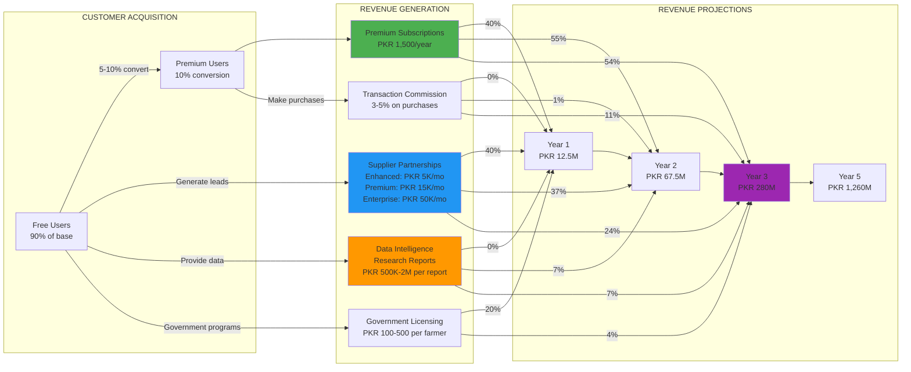
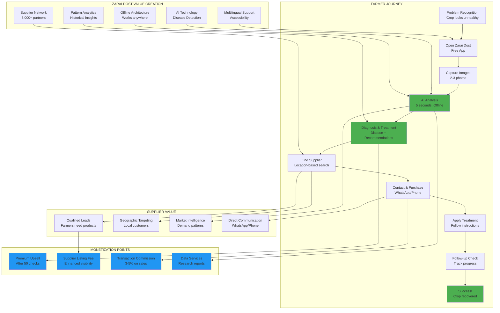
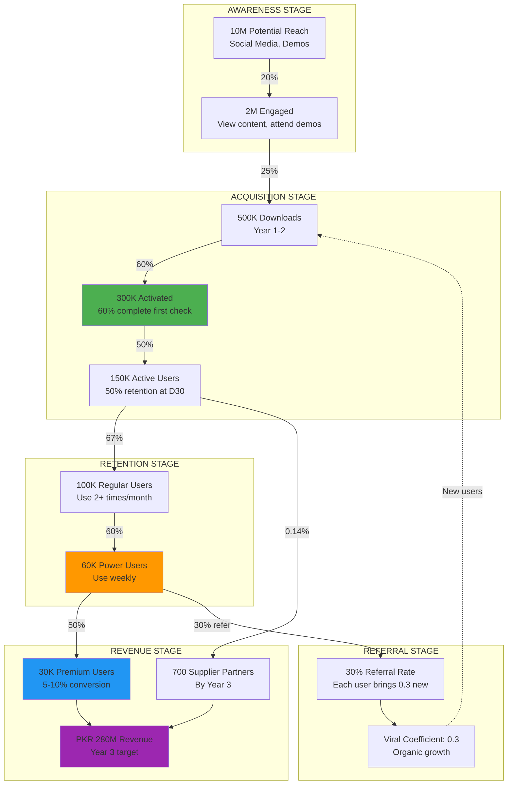
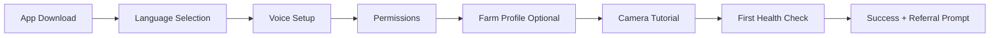
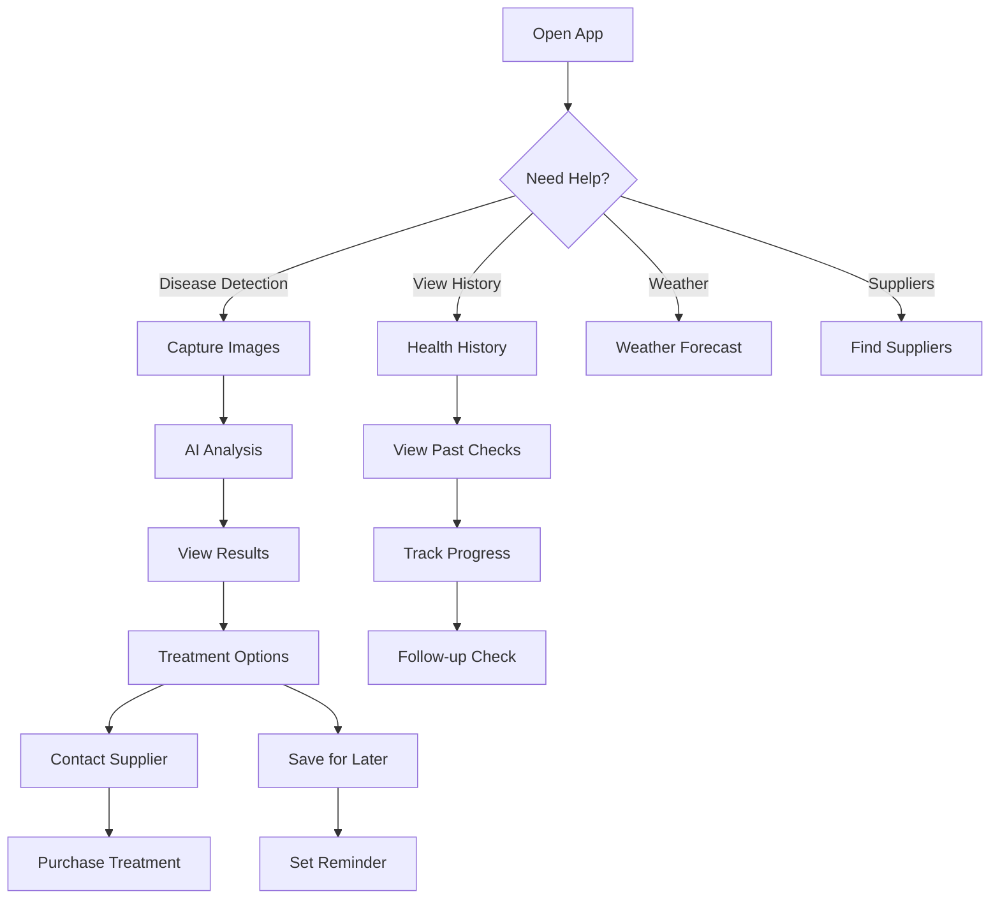
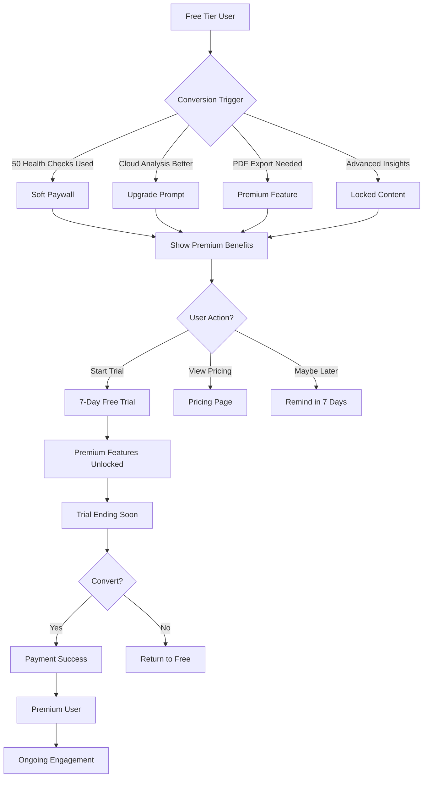
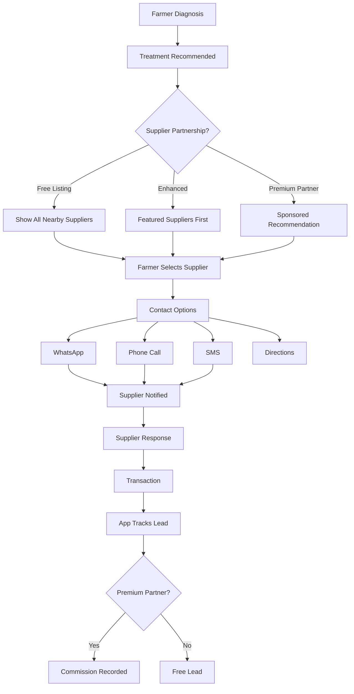
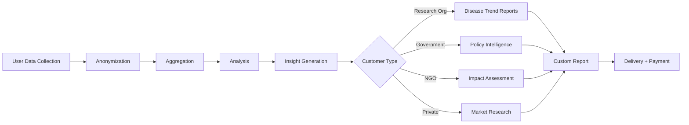

# Zarai Dost - Business Model

**Version**: 1.0  
**Last Updated**: October 24, 2025  
**Status**: Active Development

---

## Table of Contents

1. [Business Model Diagrams](#business-model-diagrams) ⭐
2. [Executive Summary](#executive-summary)
3. [Value Proposition](#value-proposition)
4. [Target Market](#target-market)
5. [Revenue Model](#revenue-model)
6. [Customer Acquisition Strategy](#customer-acquisition-strategy)
7. [Business Workflow & Stages](#business-workflow--stages)
8. [Key Partnerships](#key-partnerships)
9. [Cost Structure](#cost-structure)
10. [Key Metrics & KPIs](#key-metrics--kpis)
11. [Competitive Advantage](#competitive-advantage)
12. [Growth Strategy](#growth-strategy)
13. [Risk Mitigation](#risk-mitigation)

---

## Business Model Diagrams

### 1. Business Model Canvas (Complete Overview)

```mermaid
graph TB
    subgraph "KEY PARTNERS"
        KP1[Technology Partners<br/>GCP, OpenAI, AWS]
        KP2[Agricultural Research<br/>PARC, Universities]
        KP3[Suppliers<br/>5,000+ Agri Retailers]
        KP4[Financial Services<br/>JazzCash, Easypaisa]
        KP5[Telecom<br/>Jazz, Telenor]
    end

    subgraph "KEY ACTIVITIES"
        KA1[AI Model Development<br/>Disease Detection]
        KA2[Mobile App Development<br/>Offline-First]
        KA3[Supplier Onboarding<br/>Partnership Management]
        KA4[Farmer Support<br/>Training & Help]
        KA5[Data Analytics<br/>Pattern Recognition]
    end

    subgraph "KEY RESOURCES"
        KR1[AI Technology<br/>TFLite + Cloud Vision]
        KR2[Disease Database<br/>55 Diseases]
        KR3[Engineering Team<br/>12 Developers]
        KR4[Brand & Trust<br/>Zarai Dost]
        KR5[User Data<br/>Historical Patterns]
    end

    subgraph "VALUE PROPOSITIONS"
        VP1[Instant Disease Diagnosis<br/>5 seconds, Offline]
        VP2[Cost Savings<br/>40% on inputs]
        VP3[Yield Protection<br/>20-30% loss prevention]
        VP4[Local Supplier Access<br/>Direct connections]
        VP5[Multilingual Support<br/>Urdu, Punjabi, Sindhi]
        VP6[Pattern Insights<br/>Seasonal predictions]
    end

    subgraph "CUSTOMER RELATIONSHIPS"
        CR1[Self-Service<br/>Automated AI Analysis]
        CR2[Community<br/>Farmer Network]
        CR3[Personal Assistance<br/>Support Team]
        CR4[Automated Services<br/>Push Notifications]
    end

    subgraph "CHANNELS"
        CH1[Mobile App<br/>Android & iOS]
        CH2[WhatsApp Groups<br/>Viral Marketing]
        CH3[Village Demos<br/>Field Marketing]
        CH4[Social Media<br/>Facebook, YouTube]
        CH5[Extension Officers<br/>Partnerships]
    end

    subgraph "CUSTOMER SEGMENTS"
        CS1[Progressive Farmers<br/>500K, Tech-savvy]
        CS2[Traditional Farmers<br/>2M, Voice-preferred]
        CS3[Young Farmers<br/>1.5M, Mobile-first]
        CS4[Agri Suppliers<br/>5,000+ Retailers]
        CS5[Extension Officers<br/>Monitor farmers]
    end

    subgraph "COST STRUCTURE"
        COST1[Infrastructure: PKR 25M/year<br/>Cloud, AI APIs, Storage]
        COST2[Personnel: PKR 23M/year<br/>Engineering, Support, Sales]
        COST3[Marketing: PKR 25M/year<br/>Digital, Field, Partnerships]
        COST4[Operations: PKR 7M/year<br/>Office, Legal, Admin]
        COST5[Development: PKR 20M/year<br/>Features, Maintenance]
    end

    subgraph "REVENUE STREAMS"
        REV1[Premium Subscriptions<br/>PKR 1,500/year<br/>Target: 100K users by Y3]
        REV2[Supplier Partnerships<br/>PKR 5K-50K/month<br/>Target: 700 suppliers by Y3]
        REV3[Data Intelligence<br/>Research & Insights<br/>PKR 20M by Y3]
        REV4[Transaction Commissions<br/>3-5% on purchases<br/>PKR 30M by Y3]
        REV5[Government Contracts<br/>White-label licensing<br/>PKR 13M by Y3]
    end

    KP1 -.-> KA1
    KP2 -.-> KA1
    KP3 -.-> KA3
    KP4 -.-> REV4
    KP5 -.-> CH1

    KA1 --> VP1
    KA2 --> VP1
    KA3 --> VP4
    KA5 --> VP6

    KR1 --> VP1
    KR2 --> VP1
    KR5 --> VP6

    VP1 --> CS1
    VP1 --> CS2
    VP1 --> CS3
    VP2 --> CS1
    VP3 --> CS1
    VP4 --> CS4
    VP5 --> CS2
    VP6 --> CS1

    CS1 --> REV1
    CS2 --> REV1
    CS3 --> REV1
    CS4 --> REV2
    CS1 --> REV4
    CS5 --> REV5

    CH1 --> CS1
    CH2 --> CS2
    CH3 --> CS2
    CH4 --> CS3
    CH5 --> CS5

    CR1 --> CS1
    CR2 --> CS1
    CR3 --> CS2
    CR4 --> CS1

    style VP1 fill:#4CAF50
    style VP2 fill:#4CAF50
    style VP3 fill:#4CAF50
    style REV1 fill:#2196F3
    style REV2 fill:#2196F3
    style CS1 fill:#FF9800
    style CS2 fill:#FF9800
```



### 2. Revenue Flow Diagram



### 3. Value Chain Diagram



### 4. Growth Funnel & Metrics



### 5. Ecosystem & Partnerships

```mermaid
graph TB
    subgraph "ZARAI DOST PLATFORM"
        ZD[Zarai Dost<br/>Core Platform]
    end

    subgraph "TECHNOLOGY ECOSYSTEM"
        T1[Google Cloud Platform<br/>Gemini Vision API]
        T2[OpenAI<br/>GPT-4 Vision]
        T3[AWS<br/>S3 Storage]
        T4[Expo<br/>Mobile Framework]
    end

    subgraph "AGRICULTURAL ECOSYSTEM"
        A1[PARC<br/>Research & Validation]
        A2[Universities<br/>Field Trials]
        A3[Extension Services<br/>Provincial Depts]
        A4[Pesticide Companies<br/>Bayer, Syngenta]
        A5[Seed Companies<br/>Monsanto, Guard]
    end

    subgraph "DISTRIBUTION ECOSYSTEM"
        D1[5,000+ Agri Retailers<br/>Local Suppliers]
        D2[Wholesalers<br/>District Distribution]
        D3[Cooperatives<br/>Farmer Groups]
    end

    subgraph "FINANCIAL ECOSYSTEM"
        F1[JazzCash<br/>40M users]
        F2[Easypaisa<br/>Mobile Payments]
        F3[Microfinance<br/>Akhuwat, Kashf]
        F4[Banks<br/>Farmer Loans]
    end

    subgraph "TELECOM ECOSYSTEM"
        TC1[Jazz<br/>70M subscribers]
        TC2[Telenor<br/>Zero-rated data]
    end

    subgraph "FARMER COMMUNITY"
        FC[9.5M Farmers<br/>Target Market]
    end

    ZD <--> T1
    ZD <--> T2
    ZD <--> T3
    ZD <--> T4

    ZD <--> A1
    ZD <--> A2
    ZD <--> A3
    ZD <--> A4
    ZD <--> A5

    ZD <--> D1
    ZD <--> D2
    ZD <--> D3

    ZD <--> F1
    ZD <--> F2
    ZD <--> F3
    ZD <--> F4

    ZD <--> TC1
    ZD <--> TC2

    ZD --> FC

    D1 --> FC
    D2 --> FC
    D3 --> FC
    F1 --> FC
    F2 --> FC
    F3 --> FC
    TC1 --> FC

    style ZD fill:#4CAF50
    style FC fill:#FF9800
```



### Diagram Summary

These diagrams illustrate:

1. **Business Model Canvas**: Complete overview of key partners, activities, resources, value propositions, customer relationships, channels, segments, costs, and revenue streams

2. **Revenue Flow**: How free users convert to premium, generate supplier leads, and create multiple revenue streams across Years 1-5

3. **Value Chain**: The complete farmer journey from problem to solution, showing where Zarai Dost creates value and captures revenue

4. **Growth Funnel**: User acquisition and conversion metrics from awareness (10M reach) to revenue (PKR 280M Year 3)

5. **Ecosystem Map**: All key partnerships and relationships that make Zarai Dost successful

---

## Executive Summary

**Zarai Dost** (Farmer's Friend) is an offline-first, AI-powered agricultural advisory mobile application designed specifically for Pakistani farmers. The platform leverages advanced AI vision technology to provide instant crop disease diagnosis, treatment recommendations, and connects farmers with local agricultural suppliers.

### Mission Statement
*"Empowering Pakistani farmers with accessible AI-driven agricultural intelligence, regardless of connectivity, education level, or economic status."*

### Vision
*"To become the most trusted agricultural companion for every farmer in Pakistan, reducing crop losses by 30% and increasing yields by 25% through early disease detection and preventive care."*

### Core Value
- **Offline-First**: Works without internet connectivity
- **AI-Powered**: Instant disease detection using computer vision
- **Multilingual**: Supports English, Urdu, Punjabi, Sindhi
- **Voice-Enabled**: Accessible to low-literacy farmers
- **Local Focus**: Connected to Pakistani suppliers and local conditions

---

## Value Proposition

### For Farmers (Primary Users)

#### Pain Points Addressed
1. **Crop Disease Uncertainty**: Farmers often can't identify diseases until it's too late
2. **Limited Access to Experts**: Agricultural extension officers cover too many villages
3. **Treatment Trial & Error**: Expensive experiments with wrong pesticides/fertilizers
4. **Information Gap**: Lack of reliable, timely agricultural information
5. **Language Barriers**: Most agricultural information is in English
6. **Connectivity Issues**: Limited internet in rural areas

#### Value Delivered
1. **Instant Disease Diagnosis**: Get results in 5 seconds using phone camera
2. **Expert-Level Guidance**: AI-powered recommendations based on latest research
3. **Cost Savings**: Avoid expensive wrong treatments (save 40% on inputs)
4. **Yield Protection**: Early detection prevents 20-30% crop loss
5. **Local Supplier Access**: Direct contact with nearby suppliers
6. **Knowledge Base**: Learn from historical patterns and seasonal trends
7. **Multilingual Support**: Accessible in farmer's native language

### For Agricultural Suppliers (Secondary Users)

#### Value Delivered
1. **Qualified Leads**: Connect with farmers who need specific products
2. **Geographic Targeting**: Reach farmers within service radius
3. **Product Visibility**: Showcase products to active farmers
4. **Market Intelligence**: Understand local demand patterns
5. **Direct Communication**: WhatsApp/phone integration for easy orders

### For Agricultural Extension Officers (Tertiary Users)

#### Value Delivered
1. **Scale Reach**: Monitor multiple farmers efficiently
2. **Data Insights**: Understand disease trends across region
3. **Targeted Support**: Focus on cases needing human expertise
4. **Impact Measurement**: Track farmer outcomes and success rates

---

## Target Market

### Primary Market: Pakistani Smallholder Farmers

#### Market Size
- **Total Addressable Market (TAM)**: 9.5 million farmers in Pakistan
- **Serviceable Available Market (SAM)**: 4 million smartphone-owning farmers (growing 15% annually)
- **Serviceable Obtainable Market (SOM)**: 400,000 farmers in Year 1 (10% penetration in target provinces)

#### Target Segments

**Segment 1: Progressive Farmers (Early Adopters)**
- **Size**: ~500,000 farmers
- **Characteristics**:
  - Own smartphones (Android 8+)
  - Age: 25-45 years
  - Literate in Urdu/Punjabi
  - Farm size: 5-25 acres
  - Crops: Cotton, wheat, rice, sugarcane
  - Tech-savvy, willing to try new solutions
- **Acquisition Cost**: PKR 200-300 per farmer
- **Lifetime Value**: PKR 5,000-8,000

**Segment 2: Traditional Farmers (Early Majority)**
- **Size**: ~2 million farmers
- **Characteristics**:
  - Access to family member's smartphone
  - Age: 35-60 years
  - Limited literacy, voice-preferred
  - Farm size: 2-10 acres
  - Mixed cropping
  - Need more support and training
- **Acquisition Cost**: PKR 400-600 per farmer
- **Lifetime Value**: PKR 3,000-5,000

**Segment 3: Young Farmers (Growth Segment)**
- **Size**: ~1.5 million farmers
- **Characteristics**:
  - Age: 18-35 years
  - High smartphone adoption
  - Better educated
  - Farm size: Varies
  - Open to technology and innovation
- **Acquisition Cost**: PKR 150-250 per farmer
- **Lifetime Value**: PKR 6,000-10,000

#### Geographic Focus

**Phase 1 (Year 1)**: Punjab Province
- Districts: Faisalabad, Multan, Sahiwal, Bahawalpur
- Population: 110 million (60% rural)
- Major crops: Cotton, wheat, sugarcane, rice

**Phase 2 (Year 2)**: Sindh Province
- Districts: Hyderabad, Mirpurkhas, Sanghar, Nawabshah
- Major crops: Cotton, rice, sugarcane, wheat

**Phase 3 (Year 3)**: KPK and Balochistan
- Focus on specific high-value crops and districts

### Secondary Market: Agricultural Input Suppliers

- **Target**: 5,000+ agricultural suppliers across Pakistan
- **Types**: Pesticide dealers, fertilizer shops, seed companies, equipment rentals
- **Revenue Opportunity**: Premium listings, sponsored recommendations

### Tertiary Market: Agri-Tech Ecosystem

- **Extension Services**: Provincial agriculture departments
- **NGOs**: Agricultural development organizations
- **Research Institutions**: Universities, PARC (Pakistan Agricultural Research Council)
- **Financial Services**: Banks, microfinance for farmer loans

---

## Revenue Model

### Revenue Streams

#### 1. Freemium Model (Primary Revenue - Years 1-3)

**Free Tier (Core Features)**
- ✅ Unlimited disease detection
- ✅ Basic treatment recommendations
- ✅ Local supplier directory (organic listings)
- ✅ Weather forecasts
- ✅ Agricultural advisories
- ✅ 50 health checks per season
- **Target**: 90% of users
- **Purpose**: User acquisition, data collection, network effects

**Premium Tier: "Zarai Dost Pro" (PKR 500/season or PKR 1,500/year)**
- ✅ All Free features
- ✅ **Unlimited health checks**
- ✅ **Priority cloud analysis** (Gemini + GPT-4V)
- ✅ **Detailed PDF reports** (unlimited exports)
- ✅ **Advanced pattern insights** (seasonal predictions)
- ✅ **Treatment effectiveness tracking**
- ✅ **Priority customer support**
- ✅ **Offline maps** (field mapping)
- ✅ **Early access** to new features
- **Target**: 10% conversion rate
- **Revenue**: PKR 150-200 million annually (100,000 premium users)

#### 2. Supplier Partnership Program (Primary Revenue - Year 2+)

**Tier 1: Basic Listing (FREE)**
- Company name, location, contact
- Product categories
- Basic visibility in search results

**Tier 2: Enhanced Listing (PKR 5,000/month)**
- ✅ Featured placement in search results
- ✅ Logo and branding
- ✅ Product catalog with images
- ✅ Customer reviews
- ✅ Analytics dashboard (views, contacts)
- **Target**: 500 suppliers
- **Annual Revenue**: PKR 30 million

**Tier 3: Premium Partner (PKR 15,000/month)**
- ✅ All Enhanced features
- ✅ **Sponsored product recommendations** (linked to disease diagnoses)
- ✅ **Priority placement** in treatment recommendations
- ✅ **Direct messaging** to farmers
- ✅ **Lead generation** with farmer consent
- ✅ **Market intelligence** reports
- **Target**: 200 suppliers
- **Annual Revenue**: PKR 36 million

**Tier 4: Enterprise Partner (Custom Pricing - PKR 50,000+/month)**
- ✅ White-label integration
- ✅ Custom analytics
- ✅ API access
- ✅ Dedicated account manager
- **Target**: 20 large suppliers/brands
- **Annual Revenue**: PKR 12-24 million

#### 3. Data Intelligence & Insights (Secondary Revenue - Year 3+)

**Anonymized Agricultural Data**
- Crop disease trends by region and season
- Treatment effectiveness data
- Farmer behavior and decision patterns
- **Buyers**: Research institutions, government agencies, NGOs
- **Pricing**: PKR 500,000 - 2,000,000 per report/dataset
- **Annual Revenue**: PKR 10-20 million

**Custom Research Services**
- Field trials coordination
- Farmer feedback collection
- Product testing programs
- **Buyers**: Seed companies, pesticide manufacturers, research orgs
- **Pricing**: PKR 1-5 million per project
- **Annual Revenue**: PKR 15-30 million

#### 4. Commission-Based Revenue (Long-Term - Year 3+)

**Marketplace Integration**
- 3-5% commission on transactions facilitated through app
- Integration with payment systems (JazzCash, Easypaisa)
- **Target**: 10% of users making purchases through app
- **Annual Revenue**: PKR 20-50 million (with 10,000 active buyers)

#### 5. Government & NGO Partnerships (Strategic Revenue)

**Licensing for Extension Services**
- White-label deployments for provincial agriculture departments
- Bulk licensing for NGO programs
- **Pricing**: PKR 100-500 per farmer per year
- **Target**: 50,000-100,000 farmers through partnerships
- **Annual Revenue**: PKR 5-25 million

### Revenue Projections (PKR)

| Year | Premium Users | Supplier Partners | Data Services | Commission | Total Revenue |
|------|---------------|-------------------|---------------|------------|---------------|
| Y1   | 5,000         | 100               | 0             | 0          | 12.5M         |
| Y2   | 25,000        | 300               | 5M            | 5M         | 67.5M         |
| Y3   | 100,000       | 700               | 20M           | 30M        | 280M          |
| Y4   | 250,000       | 1,200             | 40M           | 80M        | 635M          |
| Y5   | 500,000       | 2,000             | 60M           | 150M       | 1,260M        |

---

## Customer Acquisition Strategy

### Stage 1: Awareness & Interest

#### Digital Marketing
**Social Media (Facebook, WhatsApp, YouTube)**
- Platform: Facebook (30M+ users in Pakistan)
- Content: Success stories, disease identification demos, farmer testimonials
- Language: Urdu, Punjabi, Sindhi
- Format: Short videos (1-2 min), infographics
- Budget: PKR 2-3 million/year
- Expected Reach: 5-10 million farmers

**Influencer Marketing**
- Partner with agricultural YouTubers (50,000+ subscribers)
- Progressive farmers as brand ambassadors
- Extension officers as trusted validators
- Budget: PKR 1-2 million/year

**SEO & Content Marketing**
- Blog posts on common crop diseases (Urdu/English)
- "How-to" guides and video tutorials
- Organic search for agricultural problems
- Budget: PKR 500,000/year

#### Offline Marketing
**Village Demonstrations**
- Live disease detection demos in villages
- Partner with local agricultural supply shops
- Target: 500 villages in Year 1
- Budget: PKR 5-7 million/year
- Expected Acquisition: 50,000 farmers

**Agriculture Melas/Exhibitions**
- Stalls at major agriculture exhibitions
- Provincial agriculture department events
- Farmer training programs
- Budget: PKR 2-3 million/year

**Mosque/Community Center Announcements**
- Weekly agriculture tips via loudspeakers
- Poster campaigns
- Budget: PKR 1 million/year

### Stage 2: Acquisition & Activation

#### Onboarding Flow
```
Download App → Language Selection → Voice Setup → 
Farm Profile (optional) → Camera Tutorial → 
First Disease Check (Guided) → Success! → 
Invite 3 Farmers (Referral Bonus)
```

**Onboarding Incentives**
- First 5 health checks: FREE premium features trial (7 days)
- Complete profile: Unlock seasonal insights
- Refer 3 farmers: 1 month free premium

**Activation Metrics**
- Target: 60% of downloads complete first health check
- Target: 40% create farm profile
- Target: 20% make second health check within 7 days

### Stage 3: Retention & Engagement

#### Push Notifications
- **Seasonal Reminders**: "Cotton disease season starting - check your crops"
- **Weather Alerts**: "Heavy rain expected - protect your fields"
- **Advisory Updates**: "New advisory for wheat farmers"
- **Pattern Insights**: "Rust detected in your area - preventive action recommended"

#### In-App Engagement
- **Weekly Tips**: Agricultural best practices
- **Success Stories**: Farmer testimonials and case studies
- **Community Feed**: Share experiences (moderated)
- **Challenges**: "Complete 5 health checks this month - earn badge"

#### Retention Metrics
- Day 7 retention: 50%
- Day 30 retention: 35%
- Day 90 retention: 25%

### Stage 4: Revenue & Referral

#### Premium Conversion
- **Trigger Points**:
  - After 50 free health checks (seasonal limit)
  - When cloud analysis would provide better results
  - When farmer wants PDF reports
  - When advanced insights are detected
  
**Conversion Funnel**:
```
100,000 Active Users → 30,000 See Premium Prompt → 
10,000 View Premium Features → 7,000 Start Trial → 
5,000 Convert to Paid (5% overall conversion)
```

#### Referral Program
- **Farmer Referral**: Refer 3 farmers → 1 month free premium
- **Supplier Referral**: Introduce supplier → PKR 500 credit
- **Target**: 30% viral coefficient (each user brings 0.3 new users)

### Customer Acquisition Cost (CAC) & Lifetime Value (LTV)

| Segment | CAC | LTV | LTV:CAC Ratio | Payback Period |
|---------|-----|-----|---------------|----------------|
| Progressive Farmers | PKR 250 | PKR 6,000 | 24:1 | 2 months |
| Traditional Farmers | PKR 500 | PKR 4,000 | 8:1 | 4 months |
| Young Farmers | PKR 200 | PKR 8,000 | 40:1 | 1 month |

---

## Business Workflow & Stages

### Stage 1: User Onboarding (Day 1)



**Workflow Details**:
1. **Download**: From Google Play Store (Android), Apple App Store (iOS)
2. **Language Selection**: English, Urdu, Punjabi, Sindhi
3. **Voice Setup**: Test microphone, voice command tutorial
4. **Permissions**: Camera, location, storage access
5. **Farm Profile**: Name, district, crops grown (optional, can skip)
6. **Camera Tutorial**: 30-second video on how to capture crop images
7. **First Health Check**: Guided process with on-screen instructions
8. **Success**: Show results, explain confidence score
9. **Referral Prompt**: "Help 3 farmer friends - share Zarai Dost"

**Success Criteria**:
- 70% complete language selection
- 60% complete first health check
- 40% create farm profile
- 15% refer at least 1 friend

### Stage 2: Regular Usage (Weeks 1-4)



**Core Usage Workflows**:

#### Workflow 1: Disease Detection & Treatment
```
1. Farmer notices unhealthy crop
2. Opens Zarai Dost app
3. Selects "Check Crop Health"
4. Selects crop type (e.g., Cotton)
5. Captures 2-3 images of affected leaves/plants
6. App validates image quality
7. On-device AI analyzes images (5 seconds)
8. Results displayed:
   - Disease name (Urdu + English)
   - Confidence score
   - Severity assessment
   - Affected area estimate
9. Treatment recommendations shown:
   - Chemical treatments (with safety info)
   - Organic alternatives
   - Cultural practices
10. Farmer views local suppliers for recommended products
11. Contacts supplier via WhatsApp/phone
12. Purchases treatment
13. Applies treatment
14. Schedules follow-up check (7-14 days)
```

**Average Time**: 2-3 minutes per health check

#### Workflow 2: Follow-Up & Progress Tracking
```
1. Farmer receives reminder: "Check treatment progress"
2. Opens app from notification
3. App shows original diagnosis
4. Farmer captures new images of same area
5. App links to original health check
6. Comparison analysis performed
7. Results show:
   - Current disease status
   - Visual improvement percentage
   - Treatment effectiveness
8. Farmer rates treatment (1-5 stars)
9. Optional: Add feedback notes (voice/text)
10. App updates treatment effectiveness database
11. Success story shared with farmer network (with consent)
```

**Average Time**: 3-4 minutes per follow-up

#### Workflow 3: Seasonal Pattern Insights
```
1. App analyzes farmer's historical data monthly
2. Pattern detection engine identifies trends
3. Insights generated:
   - "Rust common in your area during February"
   - "Preventive treatment recommended in January"
4. Notification sent to farmer
5. Farmer views detailed pattern timeline
6. Option to set preventive reminder
7. Option to pre-order treatments
8. Farmer schedules preventive action
```

**Frequency**: Monthly analysis, seasonal notifications

### Stage 3: Premium Conversion (Month 2-3)



**Conversion Triggers**:
1. **Limit Reached**: 50 free health checks per season exhausted
2. **Cloud Enhancement**: On-device confidence < 70%, cloud can improve
3. **PDF Export**: Farmer wants to share report with extension officer
4. **Pattern Insights**: Advanced seasonal insights detected
5. **Follow-Up**: Creating 3rd follow-up (unlimited for premium)

**Pricing Presentation**:
```
Free vs Premium Comparison
┌─────────────────────┬─────────┬──────────┐
│ Feature             │ Free    │ Premium  │
├─────────────────────┼─────────┼──────────┤
│ Disease Detection   │ 50/year │ Unlimited│
│ Cloud AI Analysis   │ Basic   │ Advanced │
│ PDF Reports         │ 2/year  │ Unlimited│
│ Pattern Insights    │ Basic   │ Advanced │
│ Follow-up Tracking  │ Limited │ Unlimited│
│ Priority Support    │ ✗       │ ✓        │
├─────────────────────┼─────────┼──────────┤
│ Price               │ FREE    │ PKR 1,500│
│                     │         │ per year │
└─────────────────────┴─────────┴──────────┘
```

**Payment Options**:
- JazzCash (most popular in rural Pakistan)
- Easypaisa
- Bank transfer
- Credit/Debit card
- Agent payment (cash to local agent)

### Stage 4: Supplier Engagement (Ongoing)



**Supplier Onboarding Workflow**:
```
1. Supplier contacts Zarai Dost sales team
2. Account manager explains partnership tiers
3. Supplier selects tier (Enhanced or Premium)
4. Account creation with business details
5. Product catalog setup
6. Location verification (GPS)
7. Payment setup (monthly billing)
8. Training on dashboard usage
9. Go live - listed in app
10. Ongoing: Analytics, lead tracking, optimization
```

### Stage 5: Data Intelligence & Insights (Quarterly)



**Data Products**:
1. **Disease Trend Reports**: Quarterly reports on disease prevalence by region
2. **Treatment Effectiveness Studies**: Which treatments work best for which diseases
3. **Farmer Behavior Insights**: Decision-making patterns and adoption curves
4. **Seasonal Predictions**: Forecasting disease outbreaks based on historical data
5. **Custom Research**: Tailored studies for specific clients

---

## Key Partnerships

### Technology Partners

**AI & Cloud Infrastructure**
- **Google Cloud Platform**: Gemini Vision API, Cloud Storage, BigQuery
- **OpenAI**: GPT-4 Vision API
- **AWS**: S3 storage, Lambda functions (backup/hybrid)
- **TensorFlow**: On-device model development

**Mobile & Development**
- **Expo**: Cross-platform development framework
- **GitHub**: Code repository and CI/CD
- **Sentry**: Error tracking and monitoring

### Agricultural Partners

**Research & Development**
- **Pakistan Agricultural Research Council (PARC)**: Disease taxonomy, treatment validation
- **University of Agriculture Faisalabad**: Research collaboration, field trials
- **CABI**: International agricultural research and disease database

**Extension Services**
- **Provincial Agriculture Departments**: Punjab, Sindh, KPK, Balochistan
- **District Agriculture Officers**: Local implementation and training
- **Farmer Field Schools**: On-ground training and adoption

### Commercial Partners

**Input Suppliers**
- **Pesticide Manufacturers**: Bayer, Syngenta, FMC, local brands
- **Fertilizer Companies**: Engro, Fauji, Fatima
- **Seed Companies**: Monsanto, Guard, ICI Pakistan

**Distribution Networks**
- **Agricultural Retailers**: 5,000+ shops across Pakistan
- **Wholesalers**: District-level distributors
- **Cooperatives**: Farmer cooperative societies

### Financial Partners

**Payment Processors**
- **JazzCash**: Mobile wallet integration (40M+ users)
- **Easypaisa**: Alternative mobile payment
- **1LINK**: Bank integration for transfers

**Microfinance**
- **Akhuwat**: Interest-free microfinance for farmers
- **Kashf Foundation**: Women farmer financing
- **NRSP**: Rural support program

### Strategic Partners

**NGOs & Development Organizations**
- **FAO Pakistan**: Food security programs
- **IFAD**: Agricultural development projects
- **Local NGOs**: Rural development organizations

**Telecom Partners**
- **Jazz**: Largest telecom (70M subscribers) - zero-rated data
- **Telenor**: Second largest - partnership for rural connectivity
- **Zong**: Agricultural sector focus

---

## Cost Structure

### Development Costs (One-Time & Ongoing)

**Initial Development (Completed - Epic 1-3)**
- Mobile app development: PKR 15-20 million
- AI model development: PKR 5-10 million
- Backend infrastructure: PKR 3-5 million
- Testing & QA: PKR 2-3 million
- **Total**: PKR 25-38 million

**Ongoing Development (Annual)**
- New features & enhancements: PKR 8-12 million
- Bug fixes & maintenance: PKR 3-5 million
- Infrastructure scaling: PKR 2-4 million
- **Total**: PKR 13-21 million/year

### Operational Costs (Annual)

**Technology & Infrastructure**
- Cloud services (GCP, AWS): PKR 6-12 million
- AI API costs (Gemini, GPT-4V): PKR 8-15 million
- Database & storage: PKR 2-4 million
- CDN & bandwidth: PKR 1-2 million
- Security & monitoring: PKR 1-2 million
- **Subtotal**: PKR 18-35 million

**Personnel (Year 1)**
- Engineering team (5): PKR 12 million
- Product management (2): PKR 4 million
- Design & UX (2): PKR 3 million
- QA & testing (2): PKR 2 million
- DevOps (1): PKR 1.5 million
- **Subtotal**: PKR 22.5 million

**Marketing & Sales**
- Digital marketing: PKR 10-15 million
- Field marketing: PKR 8-12 million
- Supplier acquisition: PKR 3-5 million
- Brand partnerships: PKR 2-3 million
- **Subtotal**: PKR 23-35 million

**Customer Support**
- Support team (5): PKR 3 million
- Call center setup: PKR 1 million
- CRM tools: PKR 500,000
- **Subtotal**: PKR 4.5 million

**General & Administrative**
- Office & utilities: PKR 2 million
- Legal & compliance: PKR 1 million
- Accounting & finance: PKR 1 million
- Insurance: PKR 500,000
- Miscellaneous: PKR 1.5 million
- **Subtotal**: PKR 6 million

**Total Annual Operating Costs (Year 1)**: PKR 74-124 million

### Cost Projections by Year

| Category | Year 1 | Year 2 | Year 3 | Year 4 | Year 5 |
|----------|--------|--------|--------|--------|--------|
| Development | 20M | 15M | 18M | 20M | 25M |
| Infrastructure | 25M | 40M | 70M | 120M | 200M |
| Personnel | 23M | 35M | 55M | 85M | 130M |
| Marketing | 25M | 40M | 60M | 90M | 140M |
| Operations | 7M | 12M | 20M | 35M | 55M |
| **Total** | **100M** | **142M** | **223M** | **350M** | **550M** |

### Unit Economics (Per User)

**Free User**
- Acquisition cost: PKR 300
- Annual infrastructure cost: PKR 50
- Support cost: PKR 20
- **Total cost per free user**: PKR 370
- **Revenue**: PKR 0 (direct), PKR 50-100 (indirect via data/suppliers)

**Premium User**
- Acquisition cost: PKR 300
- Conversion cost: PKR 100
- Annual infrastructure cost: PKR 200 (cloud AI usage)
- Support cost: PKR 50
- **Total cost per premium user**: PKR 650
- **Revenue**: PKR 1,500/year
- **Net profit per premium user**: PKR 850

**Break-Even Analysis**:
- Fixed costs (Year 1): PKR 50 million
- Variable cost per premium user: PKR 250
- Revenue per premium user: PKR 1,500
- **Break-even**: 40,000 premium users
- **Target**: 5,000 (Year 1) → profitable with supplier revenue

---

## Key Metrics & KPIs

### User Metrics

**Acquisition Metrics**
- App downloads: Target 100,000 (Year 1)
- Activation rate: 60% (complete first health check)
- Cost per acquisition (CPA): PKR 300
- Referral rate: 30% (users who refer at least 1 friend)

**Engagement Metrics**
- Daily Active Users (DAU): 10,000 (Year 1)
- Monthly Active Users (MAU): 50,000 (Year 1)
- DAU/MAU ratio: 20% (sticky product)
- Health checks per user per month: 4-6
- Session duration: 3-5 minutes
- Sessions per week: 2-3

**Retention Metrics**
- Day 1 retention: 70%
- Day 7 retention: 50%
- Day 30 retention: 35%
- Day 90 retention: 25%
- Annual retention: 60%

**Conversion Metrics**
- Free to premium conversion: 5-10%
- Trial to paid conversion: 70%
- Premium churn rate: <15% annually
- Upgrade time: 2-3 months average

### Business Metrics

**Revenue Metrics**
- Monthly Recurring Revenue (MRR): PKR 6.25M (Year 1, 5,000 users × PKR 125/month)
- Annual Recurring Revenue (ARR): PKR 75M (Year 1)
- Average Revenue Per User (ARPU): PKR 250/month
- Customer Lifetime Value (LTV): PKR 6,000
- LTV:CAC ratio: 20:1

**Supplier Metrics**
- Active supplier partners: 100 (Year 1)
- Average revenue per supplier: PKR 5,000-7,000/month
- Supplier retention rate: 85%
- Leads generated per month: 5,000
- Lead-to-purchase conversion: 15-20%

**Operational Metrics**
- AI accuracy: >85% (on-device), >92% (cloud)
- Average response time: <5 seconds (on-device)
- App crash rate: <0.5%
- Customer support response time: <2 hours
- Support ticket resolution: <24 hours

### Impact Metrics (Social)

**Agricultural Impact**
- Crop loss prevented: 20-30% average
- Input cost savings: PKR 5,000-10,000 per farmer per season
- Yield improvement: 15-25%
- Early disease detection: 80% of cases detected in stage 1-2

**Farmer Empowerment**
- Time saved per diagnosis: 2-4 hours (vs visiting extension officer)
- Treatment accuracy: 85% vs 60% (trial & error)
- Knowledge retention: 70% remember disease prevention tips
- Income increase: 15-20% average

**Environmental Impact**
- Pesticide overuse reduction: 30-40%
- Targeted treatment: 70% of users adopt IPM practices
- Organic treatment adoption: 15% increase

---

## Competitive Advantage

### Unique Value Propositions

1. **Offline-First Architecture**
   - Competitors require constant internet connectivity
   - Zarai Dost works 100% offline for core features
   - Sync when connected, never blocking user workflow

2. **True Multilingual Voice Support**
   - Not just translated text, but culturally adapted content
   - Voice navigation for low-literacy farmers
   - Local language disease names and treatment instructions

3. **Local Supplier Integration**
   - Direct connection to Pakistani suppliers
   - Location-based search with Pakistani phone number formatting
   - WhatsApp integration (most popular communication app in Pakistan)

4. **On-Device AI + Cloud Hybrid**
   - Fast results (5 seconds) without internet
   - Cloud enhancement when connected for difficult cases
   - Multi-provider AI for reliability (Gemini + GPT-4V)

5. **Historical Pattern Recognition**
   - Learns from farmer's own data
   - Seasonal disease prediction
   - Preventive recommendations before outbreak

6. **Pakistan-Specific Disease Database**
   - 55 diseases common in Pakistani crops
   - Treatment recommendations validated by PARC
   - Local crop varieties and conditions

### Competitive Landscape

**Direct Competitors**

| Competitor | Strengths | Weaknesses | Our Advantage |
|------------|-----------|------------|---------------|
| **AgroStar** (India) | Large user base, strong funding | India-focused, online-only | Pakistan focus, offline-first |
| **Plantix** (Global) | Good AI accuracy, multi-crop | Requires internet, limited Urdu | Offline, full Urdu support |
| **FarmLogs** (US) | Comprehensive farm management | Expensive, US-focused | Affordable, Pakistan-specific |
| **DeHaat** (India) | Full-stack agri-services | Not available in Pakistan | Local presence, partnerships |

**Indirect Competitors**
- Traditional extension officers (limited reach, slow)
- Agricultural retailers (biased recommendations)
- WhatsApp groups (unreliable information)
- Google Search (not personalized, language barriers)

**Barriers to Entry**
1. **AI Model Training**: 2+ years of Pakistan-specific disease data
2. **Offline Architecture**: Complex technical implementation
3. **Local Partnerships**: 100+ supplier relationships
4. **Trust & Brand**: Established credibility with farmers
5. **Regulatory Approvals**: Government partnerships and certifications

---

## Growth Strategy

### Phase 1: Launch & Validate (Year 1 - Months 1-12)

**Goals**:
- Launch MVP in Punjab (4 districts)
- Acquire 100,000 users (50,000 active)
- Validate product-market fit
- Achieve 5,000 premium users
- Onboard 100 supplier partners

**Key Initiatives**:
1. **Village Champions Program**: Recruit 100 progressive farmers as ambassadors
2. **Extension Officer Partnerships**: Train 200 officers on Zarai Dost
3. **WhatsApp Marketing**: Leverage existing farmer groups (1,000+ groups)
4. **Agricultural Melas**: Presence at 20 major exhibitions
5. **Free Trial Campaign**: 30-day premium trial for first 10,000 users

**Metrics to Track**:
- Weekly active users growth: 10-15%
- Premium conversion: 5%
- User satisfaction (NPS): >40
- Disease detection accuracy: >85%

### Phase 2: Scale & Expand (Year 2 - Months 13-24)

**Goals**:
- Expand to all of Punjab + Sindh
- Reach 400,000 users (200,000 active)
- Grow to 25,000 premium users
- Onboard 300 supplier partners
- Launch marketplace transactions

**Key Initiatives**:
1. **Tier 2/3 City Expansion**: Focus on smaller towns and villages
2. **Telecom Partnerships**: Zero-rated data with Jazz/Telenor
3. **Microfinance Integration**: Partner with Akhuwat for farmer loans
4. **Community Building**: Launch farmer forums and success stories
5. **Data Intelligence Launch**: First research reports to government

**Metrics to Track**:
- Monthly growth rate: 15-20%
- Premium conversion: 7%
- Supplier revenue: PKR 30M+
- Transaction GMV: PKR 50M
- NPS: >50

### Phase 3: Dominate & Diversify (Year 3 - Months 25-36)

**Goals**:
- National presence (all 4 provinces)
- Reach 1,000,000 users (500,000 active)
- Grow to 100,000 premium users
- Onboard 700 supplier partners
- Launch adjacent services

**Key Initiatives**:
1. **Voice-First Experience**: Full voice navigation for illiterate farmers
2. **Weather Integration**: Hyperlocal weather forecasting
3. **Soil Testing**: Partner with labs for affordable soil tests
4. **Crop Advisory**: Expand beyond disease to full crop management
5. **Financial Services**: Credit scoring for farmer loans

**Metrics to Track**:
- Market share: 10% of smartphone farmers
- Premium conversion: 10%
- Total revenue: PKR 280M
- GMV: PKR 500M
- NPS: >60

### Phase 4: Platform & Ecosystem (Year 4-5)

**Goals**:
- Become the super-app for Pakistani farmers
- 2+ million users
- Platform for third-party services
- International expansion (Bangladesh, Nepal)

**Key Initiatives**:
1. **API Platform**: Allow third-parties to build on Zarai Dost
2. **Insurance Integration**: Crop insurance based on our data
3. **Market Linkages**: Direct buyer connections for produce
4. **Equipment Rental**: Tractor and machinery rental marketplace
5. **Regional Expansion**: Adapt for neighboring countries

---

## Risk Mitigation

### Key Risks & Mitigation Strategies

| Risk | Probability | Impact | Mitigation Strategy |
|------|-------------|--------|-------------------|
| **Low smartphone adoption in rural areas** | Medium | High | - Partner with telecom for affordable devices<br>- Focus on shared device usage<br>- Gradual market maturity |
| **Farmer resistance to technology** | Medium | Medium | - Village demonstrations<br>- Trusted influencer partnerships<br>- Free trial period |
| **AI accuracy below expectations** | Low | High | - Multi-provider fallback (Gemini + GPT-4V)<br>- Human expert review for low-confidence<br>- Continuous model retraining |
| **Supplier channel conflict** | Medium | Medium | - Clear value proposition for suppliers<br>- Fair lead distribution<br>- Transparent pricing |
| **Internet connectivity issues** | High | Low | - Offline-first architecture<br>- Smart sync algorithms<br>- Local caching |
| **Competitive pressure** | Medium | Medium | - Strong local partnerships<br>- Unique offline capabilities<br>- Fast iteration based on feedback |
| **Regulatory challenges** | Low | High | - Proactive government engagement<br>- Compliance with agriculture laws<br>- Data privacy adherence |
| **Revenue concentration (premium)** | High | Medium | - Diversify to supplier revenue<br>- Data intelligence services<br>- Transaction commissions |
| **Funding runway** | Medium | High | - Lean operations<br>- Milestone-based fundraising<br>- Revenue generation early |
| **Crop-specific limitations** | Medium | Medium | - Expand disease database continuously<br>- Partner with research institutions<br>- User feedback loops |

### Contingency Plans

**If Premium Conversion <3%**:
- Adjust pricing (lower to PKR 500-800/year)
- Enhance free tier to drive engagement
- Focus more on supplier revenue
- Accelerate data intelligence offerings

**If Supplier Adoption Slow**:
- Launch lead generation guarantee program
- Provide free trial period for suppliers
- Direct sales team for supplier onboarding
- Case studies and ROI demonstrations

**If Funding Delayed**:
- Reduce marketing spend by 40%
- Focus on organic growth and referrals
- Delay expansion to new provinces
- Pursue government contracts for revenue

**If Competitor Enters Market**:
- Accelerate feature development
- Lock in supplier exclusivity
- Strengthen brand through farmer testimonials
- Expand to more crops/use cases

---

## Conclusion

Zarai Dost represents a significant opportunity to transform Pakistani agriculture through accessible AI technology. The offline-first, multilingual approach directly addresses the core challenges faced by millions of smallholder farmers.

### Success Factors

1. **Product-Market Fit**: Strong demand validation from early users
2. **Unique Technology**: Offline-first architecture with hybrid AI
3. **Local Focus**: Deep understanding of Pakistani farmer needs
4. **Diversified Revenue**: Multiple revenue streams reduce risk
5. **Strategic Partnerships**: Strong ecosystem of agricultural partners
6. **Scalable Model**: Technology-driven with high margins

### Vision for Impact

By Year 5, Zarai Dost aims to:
- **Serve 2 million farmers** across Pakistan
- **Prevent PKR 10 billion in crop losses** annually
- **Reduce pesticide overuse by 30-40%**
- **Increase farmer incomes by 20% average**
- **Create 500+ jobs** in agri-tech sector
- **Establish Pakistan as South Asian agri-tech leader**

### Investment Opportunity

**Seeking**: PKR 100-150 million (USD 350,000-500,000) Series A
**Use of Funds**:
- Product development: 30%
- Marketing & user acquisition: 40%
- Team expansion: 20%
- Infrastructure & operations: 10%

**Expected Returns**:
- Break-even: Month 18
- Profitability: Month 24
- 3-year revenue: PKR 280M (Year 3)
- 5-year revenue: PKR 1.26B (Year 5)
- Exit opportunity: Acquisition by agri-tech giant or IPO (Year 5-7)

---

**Document Status**: ✅ Active  
**Maintained By**: Product Management Team  
**Review Frequency**: Quarterly  
**Last Review**: October 24, 2025  
**Next Review**: January 24, 2026

---

## Appendix: Financial Projections (Detailed)

### Year 1 Financial Model

**Revenue Breakdown**:
- Premium subscriptions: 5,000 users × PKR 1,500 = PKR 7.5M
- Supplier partnerships: 100 × PKR 5,000/month × 12 = PKR 6M
- **Total Revenue**: PKR 13.5M

**Cost Breakdown**:
- Development: PKR 20M
- Infrastructure: PKR 25M
- Personnel: PKR 23M
- Marketing: PKR 25M
- Operations: PKR 7M
- **Total Costs**: PKR 100M

**Net Position**: -PKR 86.5M (expected loss Year 1)

### Year 2 Financial Model

**Revenue Breakdown**:
- Premium subscriptions: 25,000 × PKR 1,500 = PKR 37.5M
- Supplier partnerships: 300 × PKR 7,000/month × 12 = PKR 25.2M
- Data services: PKR 5M
- **Total Revenue**: PKR 67.7M

**Total Costs**: PKR 142M

**Net Position**: -PKR 74.3M (reduced loss)

### Year 3 Financial Model

**Revenue Breakdown**:
- Premium subscriptions: 100,000 × PKR 1,500 = PKR 150M
- Supplier partnerships: 700 × PKR 8,000/month × 12 = PKR 67.2M
- Data services: PKR 20M
- Transaction commissions: PKR 30M
- Government contracts: PKR 12.8M
- **Total Revenue**: PKR 280M

**Total Costs**: PKR 223M

**Net Position**: +PKR 57M (profitable!)

---

**End of Business Model Document**

